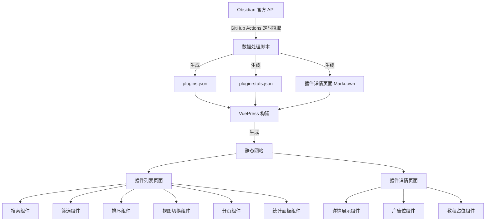
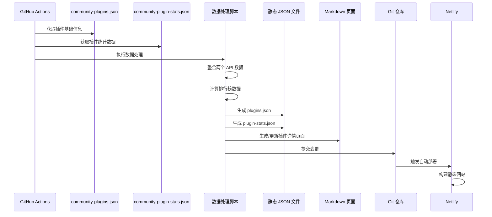

# 设计文档

## 概述

本设计文档描述了 Obsidian 插件展示栏目的技术架构和实现方案。该功能将为基于 VuePress 的文档网站新增一个完整的插件展示系统,包括数据获取、页面展示、搜索筛选等核心功能。

### 核心目标

1. 从 Obsidian 官方 API 自动获取并同步插件数据
2. 提供多种视图模式的插件列表展示
3. 支持强大的搜索、筛选和排序功能
4. 为每个插件生成独立的详情页面
5. 展示有趣的统计数据和排行榜
6. 统一管理广告位内容
7. 完全兼容现有 VuePress 主题和样式

### 技术约束

- 静态网站生成(VuePress 2.0.0-beta.61)
- 无后端数据库(Netlify 免费版)
- 所有数据以静态 JSON 文件存储
- 通过 GitHub Actions 实现自动化
- 必须兼容深色/浅色主题切换
- 响应式设计支持移动端和桌面端

## 架构设计

### 系统架构图



### 数据流设计



## 组件和接口

### 1. 数据获取层

#### 1.1 GitHub Actions 工作流

**文件位置:** `.github/workflows/update-plugins.yml`

**触发条件:**
- 定时任务: 每天 UTC 00:00
- 手动触发: workflow_dispatch
- Push 到 main 分支(可选)

**工作流步骤:**
```yaml
1. Checkout 代码
2. 设置 Node.js 环境
3. 安装依赖
4. 运行数据获取脚本
5. 运行页面生成脚本
6. 提交变更到 Git
7. 推送到远程仓库
```

#### 1.2 数据获取脚本

**文件位置:** `scripts/fetch-plugins-data.js`

**功能:**
- 从 `https://raw.githubusercontent.com/obsidianmd/obsidian-releases/master/community-plugins.json` 获取插件基础信息
- 从 `https://raw.githubusercontent.com/obsidianmd/obsidian-releases/master/community-plugin-stats.json` 获取插件统计数据
- 整合两个数据源
- 计算衍生数据(周增长、月增长等)
- 生成排行榜数据

**输入:** 无

**输出:**
- `docs/src/.vuepress/public/data/plugins.json` - 完整插件数据
- `docs/src/.vuepress/public/data/plugin-stats.json` - 统计和排行榜数据

**错误处理:**
- API 请求失败时重试 3 次
- 如果所有重试失败,保留上次成功的数据
- 记录详细错误日志到 GitHub Actions

### 2. 数据模型

#### 2.1 插件数据模型 (Plugin)

```typescript
interface Plugin {
  // 基础信息(来自 community-plugins.json)
  id: string;                    // 插件唯一标识
  name: string;                  // 插件名称
  author: string;                // 作者名称
  description: string;           // 插件描述
  repo: string;                  // GitHub 仓库地址
  
  // 统计信息(来自 community-plugin-stats.json)
  downloads: number;             // 总下载量
  updated: number;               // 最后更新时间戳
  
  // 计算字段
  weeklyDownloads?: number;      // 最近7天下载量
  monthlyDownloads?: number;     // 最近30天下载量
  weeklyGrowth?: number;         // 周增长率
  monthlyGrowth?: number;        // 月增长率
  latestVersion?: string;        // 最新版本号
  
  // 分类和标签(未来扩展)
  category?: string;             // 插件分类
  tags?: string[];               // 标签
}
```

#### 2.2 统计数据模型 (PluginStats)

```typescript
interface PluginStats {
  totalPlugins: number;          // 插件总数
  totalDownloads: number;        // 总下载量
  weeklyNewPlugins: number;      // 本周新增插件数
  monthlyNewPlugins: number;     // 本月新增插件数
  
  // 排行榜
  topByDownloads: Plugin[];      // 总下载量排行(前10)
  topByWeekly: Plugin[];         // 周热门排行(前10)
  topByMonthly: Plugin[];        // 月热门排行(前10)
  recentlyUpdated: Plugin[];     // 最近更新(前10)
  
  lastUpdated: number;           // 数据更新时间戳
}
```

### 3. 页面生成层

#### 3.1 页面生成脚本

**文件位置:** `scripts/generate-plugin-pages.js`

**功能:**
- 读取 `plugins.json` 数据
- 为每个插件生成独立的 Markdown 详情页面
- 使用统一的模板文件
- 删除已下架插件的页面
- 生成插件索引文件

**模板文件位置:** `scripts/templates/plugin-detail.md`

**模板变量:**
```markdown
---
title: {{name}}
description: {{description}}
author: {{author}}
downloads: {{downloads}}
updated: {{updated}}
repo: {{repo}}
---

# {{name}}

## 基本信息

- **作者:** {{author}}
- **下载量:** {{downloads}}
- **最后更新:** {{updatedDate}}
- **版本:** {{latestVersion}}
- **仓库:** [GitHub](https://github.com/{{repo}})

## 插件描述

{{description}}

## 教程文档

<div class="tutorial-placeholder">
  <p>📚 教程文档即将推出,敬请期待!</p>
</div>

## 相关插件

{{relatedPlugins}}

<PluginAd position="detail-sidebar" />
```

**输出路径:** `docs/src/zh/plugins/[plugin-id].md`

### 4. 前端展示层

#### 4.1 插件列表页面

**文件位置:** `docs/src/zh/plugins/README.md`

**页面结构:**
```vue
<template>
  <div class="plugin-showcase">
    <!-- 统计面板 -->
    <StatsPanel :stats="pluginStats" />
    
    <!-- 排行榜标签页 -->
    <RankingTabs :rankings="rankings" />
    
    <!-- 搜索和筛选工具栏 -->
    <ToolBar
      v-model:search="searchQuery"
      v-model:filters="filters"
      v-model:sort="sortOption"
      v-model:view="viewMode"
    />
    
    <!-- 插件列表 -->
    <PluginList
      :plugins="filteredPlugins"
      :view-mode="viewMode"
      @plugin-click="navigateToDetail"
    />
    
    <!-- 分页组件 -->
    <Pagination
      v-model:page="currentPage"
      v-model:page-size="pageSize"
      :total="totalPlugins"
    />
    
    <!-- 返回顶部按钮 -->
    <BackToTop />
  </div>
</template>
```

#### 4.2 核心组件设计

##### 4.2.1 统计面板组件 (StatsPanel)

**文件位置:** `docs/src/.vuepress/components/StatsPanel.vue`

**Props:**
```typescript
interface StatsPanelProps {
  stats: PluginStats;
}
```

**功能:**
- 显示总插件数、总下载量、本周新增等关键指标
- 使用卡片布局,支持响应式
- 数字动画效果
- 图标和颜色区分不同指标

##### 4.2.2 排行榜标签页组件 (RankingTabs)

**文件位置:** `docs/src/.vuepress/components/RankingTabs.vue`

**Props:**
```typescript
interface RankingTabsProps {
  rankings: {
    topByDownloads: Plugin[];
    topByWeekly: Plugin[];
    topByMonthly: Plugin[];
  };
}
```

**功能:**
- 三个标签页:总下载排行、每周热门、当月热门
- 显示前10名插件
- 排名徽章、趋势图标
- 点击跳转到详情页

##### 4.2.3 工具栏组件 (ToolBar)

**文件位置:** `docs/src/.vuepress/components/PluginToolBar.vue`

**Props & Emits:**
```typescript
interface ToolBarProps {
  search: string;
  filters: FilterOptions;
  sort: SortOption;
  view: ViewMode;
}

interface FilterOptions {
  category?: string;
  downloadRange?: [number, number];
  updateTimeRange?: [Date, Date];
}

type SortOption = 'downloads-desc' | 'downloads-asc' | 'updated-desc' | 'updated-asc' | 'name-asc' | 'name-desc';
type ViewMode = 'card' | 'list' | 'compact';
```

**功能:**
- 搜索框(实时搜索,防抖处理)
- 筛选器(下拉菜单或抽屉)
- 排序选择器
- 视图模式切换按钮
- 结果计数显示

##### 4.2.4 插件列表组件 (PluginList)

**文件位置:** `docs/src/.vuepress/components/PluginList.vue`

**Props:**
```typescript
interface PluginListProps {
  plugins: Plugin[];
  viewMode: ViewMode;
}
```

**功能:**
- 根据 viewMode 渲染不同视图
- 卡片视图:网格布局,显示图标、名称、描述、作者、下载量
- 列表视图:表格布局,显示详细信息
- 紧凑视图:纯文字列表
- 懒加载优化性能
- 点击跳转到详情页

##### 4.2.5 分页组件 (Pagination)

**文件位置:** `docs/src/.vuepress/components/PluginPagination.vue`

**Props:**
```typescript
interface PaginationProps {
  page: number;
  pageSize: number;
  total: number;
}
```

**功能:**
- 页码导航
- 上一页/下一页按钮
- 每页显示数量选择器
- 键盘快捷键支持(左右方向键)
- 跳转到指定页
- 显示当前范围(如"显示 1-20 / 共 1779")

##### 4.2.6 返回顶部组件 (BackToTop)

**文件位置:** `docs/src/.vuepress/components/BackToTop.vue`

**功能:**
- 滚动到一定距离后显示
- 平滑滚动动画
- 固定在右下角
- 主题适配

##### 4.2.7 广告位组件 (PluginAd)

**文件位置:** `docs/src/.vuepress/components/PluginAd.vue`

**Props:**
```typescript
interface PluginAdProps {
  position: 'detail-sidebar' | 'detail-bottom' | 'list-top';
}
```

**功能:**
- 从配置文件读取广告内容
- 支持多个广告位
- 默认显示加群引导
- 响应式布局

#### 4.3 广告位配置

**文件位置:** `docs/src/.vuepress/config/ads.ts`

**配置结构:**
```typescript
export interface AdConfig {
  position: string;
  content: string | VNode;
  enabled: boolean;
}

export const adsConfig: AdConfig[] = [
  {
    position: 'detail-sidebar',
    content: `
      <div class="join-group-ad">
        <h3>加入社区</h3>
        <p>与更多 Obsidian 用户交流学习</p>
        
        <p>扫码加入微信群</p>
      </div>
    `,
    enabled: true
  },
  // 更多广告位配置...
];
```

### 5. 样式设计

#### 5.1 主题兼容

**文件位置:** `docs/src/.vuepress/styles/plugin-showcase.scss`

**设计原则:**
- 使用 CSS 变量适配深色/浅色主题
- 继承 VuePress Theme Hope 的设计语言
- 响应式断点与主题保持一致

**CSS 变量:**
```scss
:root {
  // 浅色主题
  --plugin-bg: #ffffff;
  --plugin-border: #e5e7eb;
  --plugin-text: #1f2937;
  --plugin-text-secondary: #6b7280;
  --plugin-hover: #f3f4f6;
  --plugin-primary: #3b82f6;
}

[data-theme="dark"] {
  // 深色主题
  --plugin-bg: #1f2937;
  --plugin-border: #374151;
  --plugin-text: #f9fafb;
  --plugin-text-secondary: #9ca3af;
  --plugin-hover: #374151;
  --plugin-primary: #60a5fa;
}
```

#### 5.2 响应式断点

```scss
// 移动端
@media (max-width: 768px) {
  .plugin-list-card {
    grid-template-columns: 1fr;
  }
  
  .plugin-toolbar {
    flex-direction: column;
  }
}

// 平板
@media (min-width: 769px) and (max-width: 1024px) {
  .plugin-list-card {
    grid-template-columns: repeat(2, 1fr);
  }
}

// 桌面
@media (min-width: 1025px) {
  .plugin-list-card {
    grid-template-columns: repeat(3, 1fr);
  }
}
```

### 6. 状态管理

#### 6.1 本地存储

使用 `localStorage` 保存用户偏好:

```typescript
interface UserPreferences {
  viewMode: ViewMode;           // 视图模式
  pageSize: number;             // 每页显示数量
  sortOption: SortOption;       // 排序选项
  lastVisitedPlugin?: string;   // 最后访问的插件
}

// 存储键
const STORAGE_KEY = 'obsidian-plugin-showcase-prefs';
```

#### 6.2 URL 状态同步

使用 URL 查询参数保存筛选和搜索状态:

```
/zh/plugins/?search=dataview&sort=downloads-desc&page=2&view=card
```

**参数说明:**
- `search`: 搜索关键词
- `sort`: 排序方式
- `page`: 当前页码
- `view`: 视图模式
- `category`: 分类筛选
- `downloads_min`: 最小下载量
- `downloads_max`: 最大下载量

## 错误处理

### 1. 数据获取错误

**场景:** GitHub Actions 运行时 API 请求失败

**处理策略:**
1. 重试机制:失败后等待 5 秒重试,最多重试 3 次
2. 降级策略:如果所有重试失败,保留上次成功的数据文件
3. 通知机制:发送 GitHub Actions 失败通知
4. 日志记录:详细记录错误信息和堆栈跟踪

### 2. 页面生成错误

**场景:** 生成插件详情页面时出错

**处理策略:**
1. 单个插件失败不影响其他插件
2. 记录失败的插件 ID 到日志
3. 生成错误报告文件
4. 继续处理其他插件

### 3. 前端加载错误

**场景:** 用户访问时 JSON 数据加载失败

**处理策略:**
1. 显示友好的错误提示
2. 提供重试按钮
3. 降级到缓存数据(如果有)
4. 记录错误到控制台

### 4. 搜索和筛选错误

**场景:** 用户输入导致的异常

**处理策略:**
1. 输入验证和清理
2. 防抖处理避免频繁请求
3. 异常捕获和默认值处理
4. 用户友好的错误提示

## 测试策略

### 1. 单元测试

**测试工具:** Vitest

**测试范围:**
- 数据处理函数(数据整合、排行榜计算)
- 工具函数(搜索、筛选、排序逻辑)
- 组件逻辑(Props 验证、事件触发)

**测试文件位置:** `tests/unit/`

### 2. 集成测试

**测试范围:**
- GitHub Actions 工作流
- 数据获取和页面生成流程
- 组件交互

**测试文件位置:** `tests/integration/`

### 3. E2E 测试

**测试工具:** Playwright (可选)

**测试场景:**
- 用户浏览插件列表
- 搜索和筛选功能
- 视图模式切换
- 分页导航
- 详情页面访问

### 4. 性能测试

**测试指标:**
- 首次内容绘制(FCP) < 1.5s
- 最大内容绘制(LCP) < 2.5s
- 首次输入延迟(FID) < 100ms
- 累积布局偏移(CLS) < 0.1

**测试工具:** Lighthouse

## 性能优化

### 1. 数据加载优化

- 使用 CDN 加速 JSON 文件访问
- 启用 Gzip/Brotli 压缩
- 实现增量数据更新(仅更新变化的插件)

### 2. 渲染优化

- 虚拟滚动(如果插件数量超过 100)
- 图片懒加载
- 组件懒加载
- 防抖和节流

### 3. 缓存策略

- Service Worker 缓存静态资源
- localStorage 缓存用户偏好
- 浏览器缓存策略配置

### 4. 构建优化

- 代码分割
- Tree Shaking
- 压缩和混淆
- 资源预加载

## 部署流程


**部署配置文件:** `docs/netlify.toml`

```toml
[build]
  base = "docs"
  command = "npm run docs:build"
  publish = "src/.vuepress/dist"

[build.environment]
  NODE_VERSION = "18"

[[redirects]]
  from = "/plugins/*"
  to = "/zh/plugins/:splat"
  status = 301
```

## 安全考虑

### 1. API 访问安全

- 使用 HTTPS 访问 Obsidian API
- 不暴露敏感信息
- 限制 API 请求频率

### 2. XSS 防护

- 对用户输入进行清理
- 使用 Vue 的自动转义
- CSP 策略配置

### 3. 数据完整性

- 验证 API 返回数据格式
- 数据校验和清理
- 版本控制和回滚机制

## 可扩展性设计

### 1. 插件分类系统

**未来扩展:** 为插件添加分类标签

**实现方式:**
- 维护分类映射文件
- 支持多标签
- 自动分类(基于描述关键词)

### 2. 插件评分系统

**未来扩展:** 允许用户评分和评论

**实现方式:**
- 集成第三方评论系统(如 Giscus)
- 使用 GitHub Discussions 作为评论后端

### 3. 教程文档系统

**未来扩展:** 为每个插件添加详细教程

**实现方式:**
- 创建教程内容管理系统
- 支持 Markdown 编写
- 版本化教程内容

### 4. 多语言支持

**未来扩展:** 支持英文等其他语言

**实现方式:**
- 利用 VuePress i18n 功能
- 翻译插件描述
- 多语言路由

## 维护和监控

### 1. 日志系统

- GitHub Actions 运行日志
- 错误日志收集
- 性能监控日志

### 2. 监控指标

- 数据更新成功率
- 页面访问量
- 搜索热词统计
- 错误率监控

### 3. 定期维护

- 每周检查数据更新状态
- 每月性能审计
- 季度功能优化

## 技术债务和已知限制

### 1. 静态网站限制

- 无法实时更新数据(依赖定时任务)
- 无法实现用户个性化推荐
- 无法收集用户行为数据

**缓解措施:**
- 增加数据更新频率
- 使用客户端存储实现基础个性化
- 集成第三方分析工具

### 2. 性能限制

- 插件数量增长可能影响性能
- 大量详情页面影响构建时间

**缓解措施:**
- 实现虚拟滚动
- 优化构建流程
- 考虑增量构建

### 3. 数据准确性

- 依赖 Obsidian 官方 API
- 无法验证插件质量

**缓解措施:**
- 添加数据验证逻辑
- 显示数据更新时间
- 提供反馈渠道

## 时间线和里程碑

### 阶段 1: 基础设施(1-2 周)
- GitHub Actions 工作流
- 数据获取脚本
- 数据模型定义

### 阶段 2: 页面生成(1 周)
- 页面生成脚本
- 模板文件
- 广告位配置

### 阶段 3: 前端开发(2-3 周)
- 核心组件开发
- 样式实现
- 交互功能

### 阶段 4: 测试和优化(1-2 周)
- 单元测试
- 集成测试
- 性能优化

### 阶段 5: 部署和文档(1 周)
- 部署配置
- 使用文档
- 维护指南
