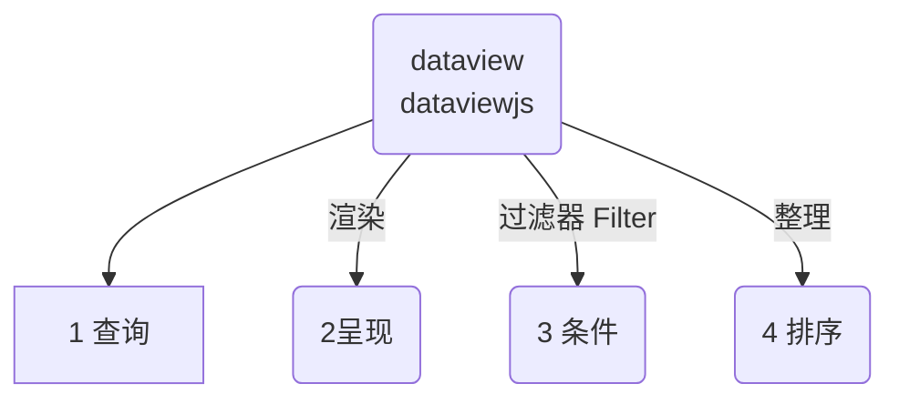
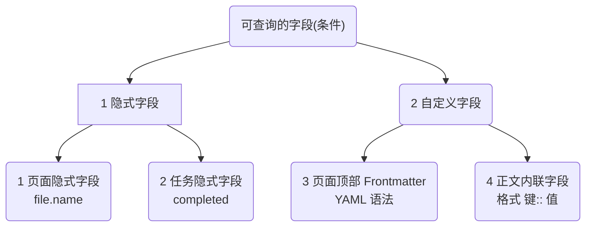

## 1 查询语句语法含义
知其然也知其所以然，所谓查询的语句是很简单的东西，只要符合规范就不会错。
::: info
Dataview 是一种简化版的 SQL 查询语句，Dataview Query Language (DQL)，所以他们也符合一定的规范，如果你刚好了解一些SQL的知识，这将很容易理解。
:::
::: warning 先从学会改动开始
- 我建议你不要看过于复杂的代码，也不要急于实现太复杂的效果，先跟着[咖啡豆](https://coffeetea.top)教程看。
- 花几分钟就能熟悉，先要知道改哪里就够了。
:::
::: danger 建议收藏用时查询
不用全记住，建议收藏[咖啡豆文档](https://coffeetea.top)，有需要的时候回来查询
:::
**完整的查询语法**   
无论 dataview 也好，dataviewjs 也罢，都必须遵循一个逻辑流程：

这个是一个典型的 dataview 的查询语句，你只要复制，格式上就不会错误。
````markdown
```dataview
list
from "obsidian" and #obsidian
sort file.ctime desc
```
````
我们大致了解一下这5行语句：
- 第1行：是固定格式，不用动，用三个点开始，表示代码块的语言是`dataview`
- 第5行：也是固定格式，不用动。表示代码块的结束。我们用三个点开始，在用三个点结束
- 第2行：list，表示呈现的样式，有4种，table、list、task、CALENDAR。按需选择，大小写无所谓
- 第3行：from，字面意思，就是从哪里查询。比如从指定的文件夹，标签、文件等
- 第4行：sort，字面意思排序，按`file.ctime`这个字段，desc排序方式。
- 其他规范：英文单词之间用**一个空格间隔**，每行一个语句，**标点符号一定要用英文符号**
**我们经常改动哪里？**
- from：指定查询的地方，
	- 如果是文件夹，格式固定为 `"文件夹"`，英文双引号里面是文件夹名字，双引号一定要有。
	- 如果是标签，格式固定为`#标签名`，英文的`#`号加上标签名字，英文的`#`号一定要有。
	- 如果同时查询两个条件，可以用`and`连接起来，表示同时具备。
	- 如果从两个条件中任一匹配一个，可以用`or`连接起来，表示或者，选择其中一个。
- sort：排序
	- 可替换`file.ctime`文件创建时间这里，`file.mtime`文件修改时间，`file.name`文件名。其他复杂的以后在研究。（了解一下，这个file.ctime叫做隐式字段）
	- 排序方式两种，`DESC`降序排列和`ASC`升序排列，
## 2 查询结果显示样式🍊
查询结果可以有四种样式：
 1. **TABLE**: 表格样式，传统的视图类型；每个数据点有一行，有几列的字段数据.
 2. **LIST**: 列表样式，匹配查询的页面的列表。你可以为每个页面输出一个单一的关联值.
 3. **TASK**: 任务列表，页面符合给定查询的任务列表.
 4. **CALENDAR**: 一个日历视图，通过其相关日期上的一个点来显示每一个命中率。
## 3 可供查询的字段🍋
既然是查询，那肯定需要指定查询的条件，就是这里的字段。主要是两种：
- 自带`隐式字段`，由 dataview 自动添加给md文件，
- 添加的自定义字段，可在页面顶部和正文自行添加。然后去调用。比如`书名:: obsidian文档`，通过查询`书名`，可以得到`obsidian文档`这个值
::: tip
我们通过查询这两种字段，达到对文件查询的目的。理解了概念，其实用起来就简单了。
:::

### 3.1 隐式字段
::: info 隐式字段是什么？
是dataview自动为md文件插入的字段，是为了增加更多的查询项目。掌握了隐式字段，也能够熟练的使用dataview的查询条件了，主要是两种：
- 一是页面文件的隐式字段，
- 二是task和list的隐式字段
:::
::: tip 隐式字段是查询条件
我们可以通过查询隐式字段，查询md文件的更多属性，比如创建时间、文件标题、修改时间等等
:::
::: danger 不要慌张
我们不必要记住这么多，只需要知道有这么个东西。需要的时候查询[本文档](https://coffeetea.top)即可。  
所以收藏本文档，防走失！
:::
**页面隐式字段**
-   `file.name`: 文件标题（一个字符串）.
-   `file.folder`: 这个文件所属的文件夹的路径.
-   `file.path`: 完整的文件路径（一个字符串）.
-   `file.ext`: 文件类型的扩展名；一般为'.md'（字符串）.
-   `file.link`: 通往该文件的链接（一个链接）
-   `file.size`: 文件的大小（以字节为单位）（一个数字）.
-   `file.ctime`: 该文件的创建日期（一个日期+时间）
-   `file.cday`: 文件创建的日期（只是一个日期）.
-   `file.mtime`: 文件最后被修改的日期（一个日期+时间）。.
-   `file.mday`: 文件最后被修改的日期（只是一个日期）。.
-   `file.tags`: 笔记中所有独特标签的一个数组. 小标签按每个级别进行细分, so `#Tag/1/A` 将被存储在数组中，作为 `[#Tag, #Tag/1, #Tag/1/A]`.
-   `file.etags`: 注释中所有显式标签的数组; unlike `file.tags`, 不包括子标签.
-   `file.inlinks`: 该文件的所有传入链接的数组.
-   `file.outlinks`: 该文件中所有外链的数组.
-   `file.aliases`: 笔记中所有别名的一个数组.
-   `file.tasks`: 一个包含所有任务的数组 (I.e., `- [ ] blah blah blah`) 在这个文件中。
-   `file.lists`: 文件中所有列表元素的数组（包括任务）；这些元素是有效的任务，可以在任务视图中呈现。.
-   `file.frontmatter`: 包含所有frontmatter的原始值；主要用于检查frontmatter的原始值或动态地列出前题的 keys 键值(字段)。

如果文件的标题内有一个日期（形式为 `yyyy-mm-dd` 或 `yyyymmdd`），或有一个Date字段/inline字段，它也有以下属性。
-   `file.day`: 与文件标题相关的明确日期.
如果你使用obsidian核心插件 "Starred Files"，以下元数据也是可用的。
-   `file.starred`: 如果这个文件已经被 "stars " obsidian插件加了星号。

**task隐式字段**
-   `status`: 该任务的完成状态，由`[]`括号内的字符决定。一般来说，空格`" "`表示未完成的任务，X`"X"`表示完成的任务，但允许支持其他任务状态的插件。
-   `checked`: 该任务是否以任何方式被检查过（即它的状态不是未完成/空的）。.
-   `completed`: 这个_具体的_任务是否已经完成；这不考虑任何子任务的完成/未完成情况。如果一项任务被标记为 "X"，则明确视为 "完成"。.
-   `fullyCompleted`: Whether or not this task and **all** of its subtasks are completed.
-   `text`: 这项任务的文本.
-   `line`: 该任务显示的行.
-   `lineCount`: 这项任务所占的 markdown 行数.
-   `path`: 该任务所在文件的完整路径.
-   `section`: 该任务包含的章节链接.
-   `tags`: 文本任务内的任何标签。
-   `outlinks`: 本任务中定义的任何链接.
-   `link`: 通往该任务附近最近的可链接区块的链接；对于建立通往该任务的链接很有用。.
-   `children`: 该任务的任何子任务或子清单.
-   `task`: 如果为真，这是一个任务；否则，它是一个普通的列表元素.
-   `completion`: 一项任务完成的日期; set by `completion...` or [shorthand syntax](https://blacksmithgu.github.io/obsidian-dataview/annotation/metadata-tasks/#field-shorthands).
-   `due`: 任务到期的日期，如果它有一个。. Set by `due...` or [shorthand syntax](https://blacksmithgu.github.io/obsidian-dataview/annotation/metadata-tasks/#field-shorthands).
-   `created`: 一个任务的创建日期; set by `created...` or [shorthand syntax](https://blacksmithgu.github.io/obsidian-dataview/annotation/metadata-tasks/#field-shorthands).
-   `start`: 一个任务可以开始的日期; set by `start...` or [shorthand syntax](https://blacksmithgu.github.io/obsidian-dataview/annotation/metadata-tasks/#field-shorthands).
-   `scheduled`: The date a task is scheduled to work on; set by `scheduled...` or [shorthand syntax](https://blacksmithgu.github.io/obsidian-dataview/annotation/metadata-tasks/#field-shorthands).
-   `annotated`: 如果任务有任何自定义注解，则为真，否则为假.
-   `parent`: 这个任务上面的任务的行号，如果存在的话；如果这是一个根级任务，则为空。.
-   `blockId`: 该任务/列表元素的块ID, if one has been defined with the `^blockId` syntax; otherwise null.
### 3.2 自定义Frontmatter前言
::: info Frontmatter 是什么
Frontmatter 是一个常见的 Markdown 扩展，它允许将 YAML 元数据添加到页面顶部。
**注意：他必须在页面的最顶部**
:::
::: tip YAML是什么
YAML 符合规范的一种数据格式，都是成对存在，`key: value` 键和值。通过查询键，可以得到对应的值。
:::
1/3 典型的frontmatter YAML定义：
````markdown
    ---
    alias: "document"
    last-reviewed: 2021-08-17
    thoughts:
      rating: 8
      reviewable: false
    ---
````
2/3 以上定义了几个字段，具体含义如下：
-   `alias`是一个文本，因为它被包装在 “” 中
-   `last-reviewed`是一个日期，因为它遵循 ISO 日期格式
-   `thoughts`是一个对象字段，因为它使用 YAML 前置对象语法
3/3 我们想查询 `thoughts.rating 为8` 的结果，以列表样式显示。
````markdown
```dataview
LIST
WHERE thoughts.rating = 8
```
````
::: warning 字段也可以是中文
注意：我们也可以直接用中文作为值
:::
1/3 定义frontmatter YAML
````markdown
    ---
    别名: "文档"
    最后审查: 2021-08-17
    想法:
      等级: 8
      可审查: 否
    ---
````
2/3 以上定义了几个字段，具体含义如下：
-   `别名`是一个文本，因为它被包装在 “” 中
-   `最后审查`是一个日期，因为它遵循 ISO 日期格式
-   `想法`是一个对象字段，因为它使用 YAML 前置对象语法
3/3 我们想查询 `想法.等级为8` 的结果，以列表样式显示。
````markdown
```dataview
LIST
WHERE 想法.等级 = 8
```
````
::: danger 标点符号必须是英文
- 特别注意，在查询和定义是时候，`:`、`""`、`.` 这些符号必须是英文符号
- 单词之间用空格间隔
:::
### 3.3 自定义inline 内联字段
就是可以在正文中插入的字段，也可以被 dataview 所查询。但是一般情况下，应该尽量避免使用，因为太零散了不容易管理。
1/2 定义内联字段
::: code-tabs
@tab 英文
```markdown
key:: value
book:: obsidian
```
@tab 中文做字段
```markdown
键:: 值
书名:: obsidian
```
:::
2/2 查询书名为obsidian的字段
````markdown
```dataview
LIST
WHERE 书名 = obsidian
```
````
### 3.4 小结：先定义字段再查询
除了 dataview 自动插入的隐式字段，其他的字段需要我们自定义
- 页面顶部的 Frontmatter 字段是常见的方式
- 页面正文的 内联字段 是辅助的定义方式
::: danger 定义字段简单灵活
熟练的掌握 自定义字段 ，让我们的 obsidian 变成了一个小系统，实现仿数据库的查询效果
- 可以结合 template 插件，很方便的生成固定格式的 Frontmatter YAML 模板
- 也可以结合 quickadd 插件，让模板的生成更快捷
- 也可以结合 button 插件，给这些动作加上一个漂亮方便的按键。让你的obsidian与众不同
:::
::: info 下章节预告
1. 在本章节，我们了解到了 dataview 的**基础语法**、**查询的原理**，**字段的自定义**。
2. 在下一节，我们尝试了解**加上限制条件的查询**，让查询更适合实际场景
:::
::: danger 加群交流
如果在使用和学习中有不明白的地方，或者想看看别人的经验
- 可以查看[进阶用法](/zh/advanced)
- 可以加群和大家聊聊，加微信 `coffeebean1688` 蹦跶的咖啡豆，然后进群
- 可以查看[咖啡豆豆龙_哔哩哔哩](https://space.bilibili.com/618777356)) 视频教程。😜**关注、👍点赞、📀投币一键三连**
- 示例库（筹备中）
:::