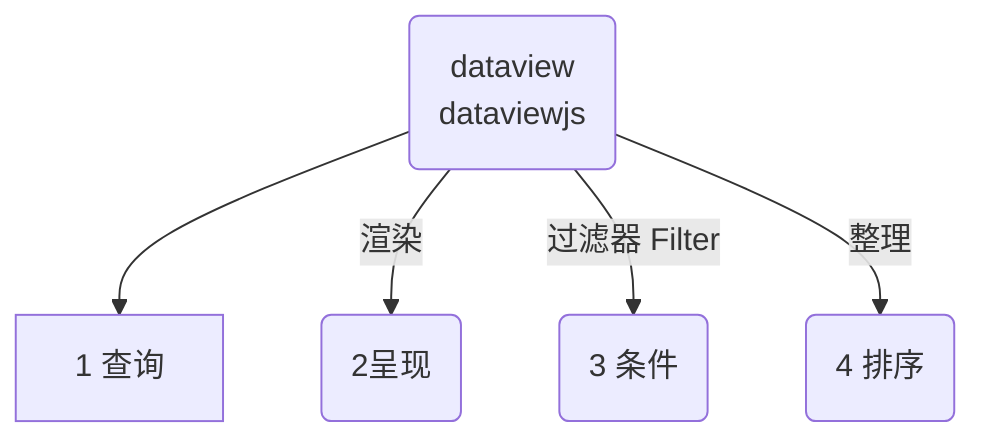

---
# 这是文章的标题
title: Dataview进阶(2)
# 这是侧边栏的顺序
order: 2
# 这是页面的图标
icon: page
---
无论 dataview 也好，dataviewjs 也罢，都必须遵循一个逻辑流程：


## From 来源从哪里查
::: tip
你得指定查询的地方，比如哪个文件夹，或者标签之类的
:::
1. **标签**：从一个或多个标签范围内查询，语法是 `#标签名`，井号不能省略。
2. **文件夹**：从文件夹（及其所有子文件夹）中选择，语法是`"文件夹名"`，双引号不能省略。
3. **单个文件**：查询指定的单个文件，语法是：`文件路径/文件名字.md`
4. **链接**：可以查询链接，指向文件的链接，也可以选择来自文件的所有链接
	1. 要获取链接到 `[[笔记名]]` 的所有页面，请使用 `FROM [[笔记名]]`
	2. 要获取从 `[[笔记名]]` 链接的所有页面（即该文件中的所有链接），请使用 `FROM outgoing([[笔记名]])`

### 在from里过滤filters
::: warning
很多时候，我们需要进行一定的筛选过滤，
- 比如同时要查文件夹下的某个标签，
- 或者不想要某个标签。
- 或者不想要某个文件。
:::

::: danger 筛选条件
我们可以使用几个条件进行筛选，非常容易理解。  
注意英文符号，前后有一个空格
- `and` ：和，同时满足
- `or` ：或者，任选其一
- `-`：  减去，排除掉这个条件
:::
::: code-tabs
@tab and 同时
```sql
# 查询 文件夹名1 下同时有 #标签名 的数据
from "文件夹名1" and #标签名

# 查询 文件夹名1 和 文件夹名2 ，同时查两个文件夹
from "文件夹名1" and "文件夹2"
```
@tab or 或者
```sql
# 查询 #标签名1 或者 #标签名1 ，任选其中一个
from #标签名1 or #标签名2

# 查询 文件:文件名1 或者 文件:文件名2 中的内容，任选其一
from [[文件名1]] or [[文件名2]]
```
@tab - 排除
```sql
# 查询 文件夹:文件夹名1，并且排除其中带有标签 #标签名1 的文件
from "文件夹名1" - #标签名1

# 查询 文件夹:文件夹名1，并且排除其中的文件:文件名1
from "文件夹名1" - [[文件名1]]
```
:::


## List 呈现的样式
查询结果可以有四种样式：
 1. **TABLE**: 表格样式，传统的视图类型；每个数据点有一行，有几列的字段数据.
 2. **LIST**: 列表样式，匹配查询的页面的列表。你可以为每个页面输出一个单一的关联值.
 3. **TASK**: 任务列表，页面符合给定查询的任务列表.
 4. **CALENDAR**: 一个日历视图，通过其相关日期上的一个点来显示每一个命中率。
## Where 过滤器-查函数
作为参考SQL的DQL查询，也会使用SQL查询的概念。where 就是一个典型的条件语句。他的作用就是过滤掉符合你要求条件的内容。


::: tip
- 所以你理解为一个过滤器，你指定条件，他帮你过滤内容
- where 后面跟上条件，这里可以使用dataview提供的大量内置函数来实现效果。
:::

::: warning 
- 下面放一些常用的函数，其实常用的就这么写，稍微举几个例子，大家也就清楚了。
- 其他的函数，参考执行就可以。
- 复制这里贴出的代码，严格注意格式，==符号都是英文==
:::

### contains() 包含函数
- 对于对象，检查该对象是否有具有给定名称的键
- 对于列表，检查是否有任何数组元素等于给定值
- 对于字符串，检查给定值是否为子字符串
```sql
contains(file.name, "咖啡豆") = true
# 检查对象 file.name ，包含“咖啡豆”，就返回结果为 真
```

### 实战1:where带contains()函数查询

::: code-tabs
@tab contains语句
```sql
where contains(file.name, "咖啡豆") = true
# 检查对象 file.name ，包含“咖啡豆”，就返回结果为 真

# 1. file.name 是dataview的隐式字段，前面讲到过，还有很多可以拿来查询
# 2. "咖啡豆"  是查询的文字，必须用英文的双引""号包裹
```
@tab 完整查询语句table
```sql
table 
	file.mtime as "修改时间"
from ""
where contains(file.name, "咖啡豆") = true
sort file.name desc

# 用表格显示结果，表头是文件修改时间。
# 从所有的文件里查询
# 过滤条件是：文件名中包含咖啡豆的结果
# 按照文件名排序
# 1. file.name 是dataview的隐式字段，前面讲到过，还有很多可以拿来查询
# 2. "咖啡豆"  是查询的文字，必须用英文的双引""号包裹
```
@tab 完整查询语句list
```sql
list
from ""
where contains(file.name, "咖啡豆") = true
sort file.name desc

# 用列表显示结果
# 从所有的文件里查询
# 过滤条件是：文件名中包含咖啡豆的结果
# 按照文件名排序
# 1. file.name 是dataview的隐式字段，前面讲到过，还有很多可以拿来查询
# 2. "咖啡豆"  是查询的文字，必须用英文的双引""号包裹
```
:::

`file.name`、`file.tags`、`file.path`、`file.folder` 等等众多的隐式字段都可以使用。但是注意有些字段是时间格式，不能错误。

> **参考文档**：[隐式字段](dataview进阶(1).md#隐式字段)

### date(any) 日期函数
从提供的字符串、日期或链接对象中分析日期（如果可能），否则返回nul
```sql
date("2020-04-18") 
# 日期对象代表 2020年4月18日

date([[2021-04-16]])
# 给定页面的日期对象，参考file.day
```

### dur(any) 从字符串解析时间
从提供的字符串或持续时间分析**持续时间**，失败时返回null
```sql
dur(8 minutes)
# 8分钟

dur("8 minutes, 4 seconds")
# 8分4秒

dur(dur(8 minutes))
# dur(8 minutes) = <8 minutes>
```

### 实战2:where带2个函数查询
```sql
list
from ""
WHERE file.mtime >= date(today) - dur(7 day)
sort file.mtime desc
```

```sql
table without id
	file.link as 文件名,
	file.folder as "文件夹",
	file.mtime as 修改时间
from "" and -#obsidian
WHERE file.mtime >= date(today) - dur(7 day)
sort file.mtime desc
limit 20
```


### 更多函数
::: tip 施工中
挖坑待填
:::

## Where 过滤器-查自定义字段
我们也可以查询自定义字段，也就是前文所讲的 `frontmatter` 和 `inline 内联字段`

> 参考资料：[自定义 Frontmatter前言](dataview进阶(1).md#自定义Frontmatter前言)


## Sort 排序
按一个或多个字段对所有结果进行排序。

```
SORT date [ASCENDING/DESCENDING/ASC/DESC]
```

```sql
sort file.mtime desc
```

::: tip 自定义标题
- ASC：升序
- DESC：降序
:::

::: danger 加群交流
如果在使用和学习中有不明白的地方，或者想看看别人的经验
- 可以查看[进阶用法](/zh/advanced)
- 可以加群和大家聊聊，加微信 `coffeebean1688` 蹦跶的咖啡豆，然后进群
- 可以查看B站视频、YouTube了解（筹备）
- 示例库（筹备中）
:::