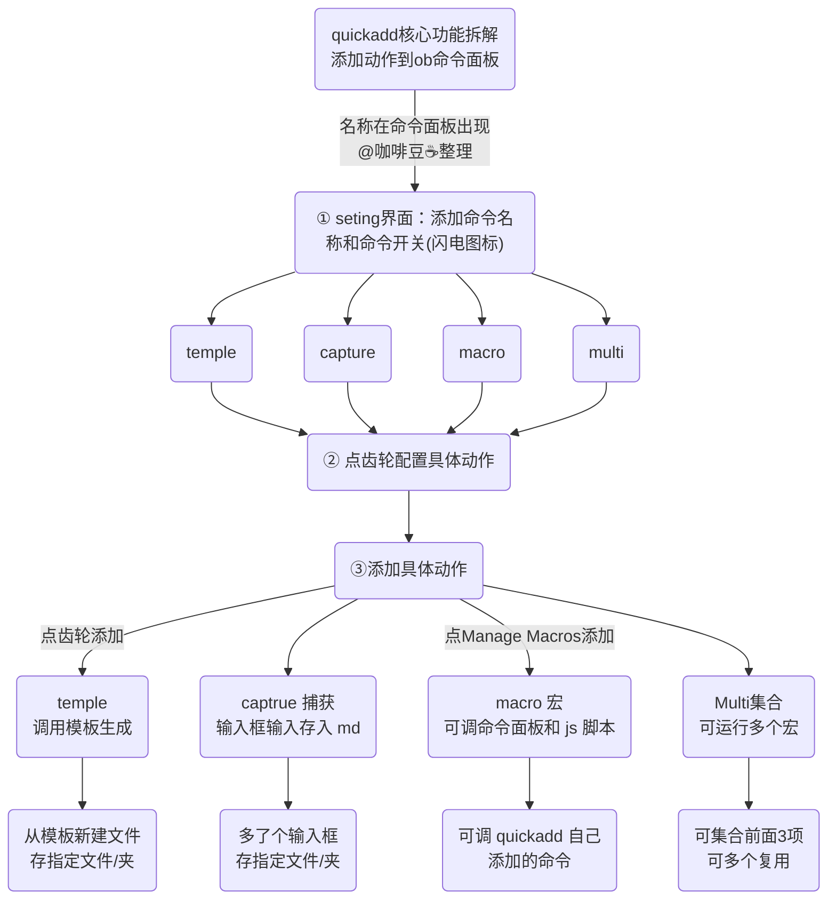

## 1 QuickAdd 一图了解

QuickAdd 主要功是添加 `obsidian系统命令`，可在命令面板调用，可以将一系列的动作简化成一个命令操作。

**主要功能包括：**
 1. 快速添加笔记：通过命令，可以在当前笔记所在添加新笔记，并使用自定义的文本格式和 template 模板文件来编辑笔记标题和正文内容，并在指定的文件夹中创建新笔记。
 2. 快速添加任务：通过命令，可以添加任务到指定的文件中。
 3. 支持自定义文本格式和 template 模板文件，同时，用户也可以设置一个默认的 template 模板文件来创建新笔记和任务。

::: tip QuickAdd 添加的命令中可以调用
1.  **template 模板**、
2. **capture 捕获(输入框保存文件)**、
3. **macro 宏**调用**命令**和**js 脚本**，
4. 以及这三类的**集合 muliti**。详细见下图：
:::

## 2 逻辑运行图(注意看序号)

::: danger 打开obsidian的 quickadd同时看图
不要觉得流程图复杂，请打开obsidian对照4个功能。其实很简单
:::

::: tip 技巧1
QuickAdd 可通过命令面板直接调用，也可以和 button 插件配合使用，点击按钮调用命令。推荐和 button 插件结合。
:::

## 3 使用方法
我们其实用的最多是就是`temple调用模板`新建笔记，还有`captrue 捕获`添加内容到指定文件。
- temple 模板举例：新建一个带有tp模板语法的文件到日记文件夹。并且自定义文件名为当前日期。
- captrue 捕获举例：增加灵感笔记，在 `灵感.md`文件中，添加每次写的一小段文字。

::: warning
不要贪多，使用这2个足够了。
:::

### 3.1 template 命令使用方法

Template 命令就是从指定模板新建文件，到指定文件

#### 3.1.1 新建命令并添加到系统命令中
1. 打开插件->设置->quickadd
2. 输入 name 命令名称(调用使用)，选择 template，点击 add choice 添加命令
3. **添加到 ob 命令面板**：点亮闪电符号，就可在 Ob 命令面板看到此命令。

#### 3.1.2 template 详细配置：点击齿轮符号：
1. `Template Path` 模板所在路径
2. `File Name Format` 文件名格式/按语法自动命令 {{data}}
3. `Create in folder` 指定的文件夹中创建文件
4. `Open the created file`. 打开创建的文件
![[Pasted_image_20230330234713.png]]

#### 3.1.3 调用命令
使用 Ctrl+P 调出命令面板，搜命名。回车启动即可使用。其他插件也可以调用这个命令。

::: danger
可以在button插件的button里添加这条命令，以后就不用打开命令面板了。在button的教程里展开。
:::

### 3.2 Capture 命令的使用方法

::: tip
捕获命令，与 template 类似，多一个弹窗获取信息并写入文件。可以理解为给 Template 加个输入框。
:::

#### 3.2.1 新建 Capture 的方法
1.  打开插件->设置->quickadd
2.  输入 name 命令名称(调用使用)①，选择 Capture ②，点击 add choice 添加命令③
3.  **添加到 ob 命令面板**：点亮闪电符号，就可在 Ob 命令面板看到此命令。

#### 3.2.2 Capture 详细配置：点击齿轮符号
::: tip 配置Capture
- 当按照上述步骤添加 Capture 之后，在QuickAdd Settings里面会有新的命令，注意你添加的 `name` 。
- 点后后面的⚙️图标，进行 Capture 的详细配置
:::

##### 3.2.2.1 常规配置

##### 3.2.2.2 格式化语法 Capture
在用 capture 捕获输入内容的时候，可对内容进行格式化。具体位置在 Capture 设置面板的最底下`capture format`。

::: warning
输入`{{` 两个花括号，会自动提示语法。这是**对输入的内容进行格式化**
:::

- `{{DATA}}` 插入系统当前日期，不包括时间
- ==`{{VALUE}}` 就是你输入的内容==
- `{{MACRO:悬浮emos}}` **可直接调用宏命令**
- `{{VALUE:}}` 和上面一样，`:`冒号后是说明文字(输入框顶部)。举例`{{VALUE:请输入内容}}`
- 支持 mark 语法和空格，可以组合使用，比如 `- {{DATE}} {{VALUE}}`  这个就是输入一个**无序列表**，插入了**系统日期**，加了个**空格**，然后跟上你**输入的内容**。

::: tip 技巧2：插入时间可自定义
插入时间 `{{DATE:YYYYMMDD_hhmm}}`，还可以注明时间格式，
`{{DATE:YYYY-MM-DD_hhmm_ddd}}` 年-月-日-分-秒-周几
具体可以输入在 quickadd 会看到实时的显示
:::

::: tip 技巧3
- 在 `- {{DATE}} {{VALUE}}` 后加个回车换行，这样输入内容的时候会自动换行。不会在同一列里。
- 在 Capture format 这里可以直接调用 maro 宏脚本
:::

::: danger 扩展阅读
后面会发一个实例来说明具体的操作
:::

::: danger 加群交流
如果在使用和学习中有不明白的地方，或者想看看别人的经验
- 可以查看[进阶用法](/zh/advanced)
- 可以加群和大家聊聊，加微信 `coffeebean1688` 蹦跶的咖啡豆，然后进群
- 可以查看[咖啡豆豆龙_哔哩哔哩](https://space.bilibili.com/618777356)) 视频教程。😜**关注、👍点赞、📀投币一键三连**
- 关注公众号(文章很多)：`蹦跶的咖啡豆
- 示例库（筹备中）
:::

::: details 🌱【点我-扫码加群】
 
::: 

::: details 🍻【点我-打赏】

::: 

