---
# 这是文章的标题
title: Tasks进阶(2)
# 这是侧边栏的顺序
order: 8
# 这是页面的图标
icon: page
---
::: tip
本章节主要分析 tasks 插件的语法
:::
<BiliBili bvid="BV12y4y1d7N6" />
上一篇讲解了tasks 插件的基本操作，如何添加tasks任务和一些小技巧。下面我们主要研究 tasks的一些查询语法。

```mermaid
  flowchart TD
      A("tasks查询流程") --> B["1输入"]
      A --> C("2查询务")
      
      B --> B1("任务信息")
      B1 --> B11("任务描述")  
      B1 --> B12("重要程度")  
      B1 --> B13("到期时间")  
      B1 --> B14("开始时间")  
      B1 --> B15("循环周期")  
      
      C --> C1("查询语句")  
      C1 --> C11("展示")    
```




## 一、tasks 查询语法能干什么？
简单说，就是根据已经输入的任务信息。对任务进行查询，按照我们设定好的条件，展示不同的效果。灵活定制，想你所想。

::: tip 
tasks 能够实现大部分，目前市面上的各类TODO软件的收费功能。当然这需要你熟悉他的一些配置。
:::

### tasks演示效果：
用tasks实现的查询效果，都是自动刷新，自动查询的。

#### tasks演示1:obsidian四象限(咖啡豆原创制作)
实现根据任务的轻重缓急，时间进度。自动展示到不同的区域。
 

#### tasks演示2：obsidian回顾面板(咖啡豆原创制作)
实现按照天、周、月份、年度的展示回顾任务。方便自己对完整事项的掌握。


## 二、添加任务了解参数
::: tip
在我们开始使用tasks前，需要检查基础配置，回顾上一章节的知识。不熟悉可回看上一章内容
:::
系统默认任务，或者tasks插件，都需要了解任务在markdown语法中的几种状态和相关参数。
### 1/3 设置好全局过滤标签
::: warning
强烈推荐：安装 tasks 插件后，开启 Global task filter 全局标签过滤。
- 打开插件 → 设置 找到tasks ，找到 Global task filter 全局标签过滤
- 在这里填写 `#task` 。意思是过滤包含`#task`标签的任务。
:::

### 2/3 添加任务的方法
详见 [tasks进阶(1)#添加任务的方法](/zh/advanced/tasks%E8%BF%9B%E9%98%B6(1).html#_3-3-%E4%BD%BF%E7%94%A8) 按Ctrl+鼠标点击新窗口打开
- 命令面板，输入 task，选择Tasks: Create or edit task。
- 但是更推荐自定义快捷键快速插入任务，我的自定义是 `Ctrl + T` 
::: tip danger 自定义快捷键
推荐自定义快捷键快速插入任务，我的自定义是 `Ctrl + T` 。下面不在解释

在obsidian 设置 → 快捷键 → 搜索：`tasks`找到 edit。给他添加快捷键
:::

### 3/3 任务状态待办和完成
**示例：**  
- [ ] 这个是待办事项
- [x] 这个是待办事项完成
- [ ] #task 这个是tasks插件添加的任务

## 😘实战1.添加任务


### 任务的参数
1. Description：任务描述，就是正文
2. Priority：重要程度，依次是 Low 低、Normal一般、Medium中等、High高
3. Recurs：循环任务，按周期
4. Due：到期时间
5. Scheduled：计划任务
6. Start：开始时间
7. Status 状态
	- todo，计划
	- Done
	- In Progress
	- Cancelled

## 三、查询任务完成和日期
::: tip 设计原则
在这里，我将tasks插件的用法进行了拆解，没有按照官方来讲解。官方的过于复杂，然后逻辑有点混乱，不太适合新手使用。我们先易后难，先用起来再说。
:::

::: danger  掌握任务和日期就够了
使用最多的就是任务完成状态，还有日期。掌握这个就足够使用tasks了
:::

### 1.日期 Data
首先，日期 **data** 可以用自然语言或者具体的日期。如果是在tasks插件输入时间可以输入范围。由tasks插件计算时间。比如 `3 day`，会自动计算成3天之后的具体时间。
::: tip
这是 tasks 插件中使用最多的参数，设定日期。包括开始时间、到期时间、重复时间等等。只要涉及到日期就是这里使用。
- due <到期时间>
- start <开始时间>
- Scheduled <计划时间>
:::

准确的查询语法类似`due 日期`，日期可以是以下形式：

::: code-tabs
@tab:active 具体日期📆
```markdown
2023-02-14
```
@tab 相对日期🙆
```markdown
yesterday
today
tomorrow
this week/month
next week/month
weekend
in three weeks
last Monday
next Friday
14 days ago
in two weeks
```
@tab 重复日期⏰
```markdown
every 3 days (每3天)
every 10 days when done 
every weekday (meaning every Mon - Fri)
every weekday （表示每周一至周五）
every week on Sunday (每周日)
every 2 weeks（每两周一次）
every 3 weeks on Friday （每3周的周五一次）
every 2 months （每两月一次）
every month on the 1st  (每月1号)
every month on the last   
every month on the last Friday
every month on the 2nd last Friday
every 6 months on the 2nd Wednesday 每过6个月的第2个星期三1次
every January on the 15th
every February on the last
every April and December on the 1st and 24th (meaning every April 1st and December 24th)
every April and December on the 1st and 24th （指每年4月1日和12月24日）
every year (每年)
```
:::

::: tip 日期的优先顺序
1. Due date 到期日
2. Scheduled date 预定日期
3. Start date 开始日期
:::

### 2.任务完成 Done
**任务完成状态🍖：**
- **完成**的任务，使用 `done` 
- **未完成**的任务，使用`not done

### 3.任务和日期 Done & Data
 **任务完成时间📅：**  
 - `done (before, after, on) <date>`，
 - 完成在(之前，之后，在某天) 日期
 - done before 1 week，在之前一周完成的

**任务是否有日期🧭：**  
- `has done date`  有完成日期
- `no done date` 没有完成日期
- `done date is invalid` 完成日期无效(比如2.30日)

::: tip 释义
before=之前，after=之后，on=在
:::

## 😘实战2:使用时间和完成状态查询任务
看累了吧，这么一篇长文，费劲的。我们来暂停一下，将这里的命令复制回去，看看能否查询到什么内容。不过请记得修改为自己的！


::: code-tabs#实战1
@tab 所有未完成任务#id11
````markdown
```tasks
not done
```
````
@tab 所有完成任务#id22
````markdown
```tasks
done
```
````
@tab 今天到期的所有未完成任务#id33
````markdown
```tasks
not done
due today
```
````
@tab 今天到期的所有未完成任务#id44
````markdown
```tasks
not done
due after yesterday
due before in two weeks
```
````
:::

::: code-tabs#实战1
@tab 所有未完成任务#id11
````markdown
查询所有【未完成】的任务
````
@tab 所有完成任务#id22
````markdown
查询所有【完成】的任务
````
@tab 今天到期的所有未完成任务#id33
````markdown
未完成的
今天到期
````
@tab 今天到期的所有未完成任务#id44
````markdown
没有完成
昨天到期
两周后到期

整体时间是：昨天到期~两周后到期，在这个时间区间内的任务
````
:::

## 四、组合查询条件🧧
### 1/3 多个条件使用布尔运算符连接：  
当单一的查询，无法准确的确定范围时。我们可以将几个查询条件组合使用
::: tip 注意大写
查询条件用`(查询条件)`圆括号包裹，查询条件之间使用布尔运算符连接，运算符如下，**注意使用大写**：
:::
- **AND**，同时满足⭐️常用
- **OR**，或者，任选其一⭐️常用
- **NOT**，否，不是的⭐️常用
- AND NOT，要求第一个过滤器匹配，第二个过滤器不匹配
- OR NOT，要求第一个筛选器匹配，或第二个筛选器不匹配
- XOR，只需要两个筛选器中的一个进行匹配，**不要将两个以上的XOR筛选器与组合在一起**

::: danger 注意
- 查询条件用`(查询条件)`圆括号包裹，查询条件之间使用布尔运算符连接。
- **运算符注意使用大写**
- 圆括号不能省略，否则报错。
- 组合条件可超过2个，但XOR不能同时两个以上(不含两个)
:::
**举例：**  
::: code-tabs
@tab AND 同时👍
```markdown
(due after yesterday) AND (due before in two weeks)
```
@tab OR 任选其一👍
```markdown
(tags include #inbox) OR (path includes Inbox) OR (heading includes Inbox)
(tag includes #XX) OR (tag includes #YY) AND (tag includes #ZZ)
( (tag includes #XX) AND (tag includes #YY) ) OR (tag includes #ZZ)
```
@tab NOT 否，不是❓👍
```js
11
```
@tab AND NOT
```markdown
# 注释：要求第一个过滤器匹配，第二个过滤器不匹配
(has start date) AND NOT (description includes some)
```
@tab OR NOT
```
# 注释：要求第一个筛选器匹配，或第二个筛选器不匹配
(has start date) OR NOT (description includes special)
```
@tab XOR
```
# 只需要两个筛选器中的一个进行匹配，**不要将两个以上的XOR筛选器与组合在一起**

```
:::
::: tip 布尔运算适可而止
不需要使用过于复杂的 **布尔运算** 进行筛选，常用的就前面三个。太复杂的查询反而是个负担
:::

### 2/3 查询条件组合不要过多：  
- 查询条件不要嵌套太多，2~3个就可以了。
- 查询**布尔运算**尽量使用前面三个，后面过于复杂建议不使用，避免绕脑！

### 3/3布尔运算执行优先级
运算符按以下顺序计算：

1.  `NOT`
2.  `XOR`
3.  `AND`
4.  `OR`

## 😘实战3:使用组合查询

::: code-tabs#标签id要改不要重复(联动的上下一致)
@tab  AND 同时#id1
````markdown
not done
(due after yesterday) AND (due before in two weeks)
````
@tab OR 任选其一#id2
````markdown
(tags include #inbox) OR (path includes Inbox) OR (heading includes Inbox)

(tags include #DailyNote) OR ((path includes daily/Notes/Folder/) AND (path does not include 2022-07-11))
````
@tab NOT 否，不是❓#id3
````markdown
NOT (path includes inbox)
````
@tab AND NOT#id4
````markdown
(has start date) AND NOT (description includes some)
````
@tab OR NOT#id5
````markdown
(has start date) OR NOT (description includes special)
````
:::

::: code-tabs#标签id要改不要重复(联动的上下一致)
@tab AND 同时#id1
````markdown
没有完成
昨天到期的 同时 2周后到期的 （也就是从昨天~到两周后区间范围的）
````
@tab OR 任选其一#id2
````markdown
(标签 包括 #inbox) 或者 (路径 包括 Inbox) 或者 (标题 包括 Inbox)
以上条件任选其一，满足其中任意一个即可

(tags include #DailyNote) OR ((path includes daily/Notes/Folder/) AND (path does not include 2022-07-11))
我希望查看保管库中任何位置带有标记的任务或每日便笺文件夹中的任务，但不希望查看今天的每日便笺中的任务。 `#DailyNote`
````
@tab NOT 否，不是#id3
````markdown
NOT (path includes inbox)
路径里不包含“inbox”
````
@tab AND NOT#id4
````markdown
要求第一个过滤器匹配，第二个过滤器不匹配
(has start date) AND NOT (description includes some) =>
  AND (All of):
    has start date
    NOT:
      description includes some

````
@tab OR NOT#id5
````markdown
要求第一个筛选器匹配，或第二个筛选器不匹配
(has start date) OR NOT (description includes special) =>
  OR (At least one of):
    has start date
    NOT:
      description includes special
````
:::

::: danger 尽量使用前面三个
查询**布尔运算**尽量使用前面三个，后面过于复杂建议不使用，避免绕脑！
:::

## 五、控制结果的显示样式
显示样式布局有以下选项：可以设置为 `show` 和 `hide`
-   `edit button` 编辑按钮
-   `backlink`  反向链接
-   `urgency` 紧迫性
-   `priority` 重要等级
-   `start date` 开始日期
-   `scheduled date` 计划日期
-   `due date` 到期日期
-   `done date` 完成日期
-   `recurrence rule` 
-   `task count` 任务数量统计

::: code-tabs
@tab 面板1
```markdown
show due date     // 展示 到期日期
hide backlink     // 隐藏 baklink
hide start date   // 隐藏 开始日期
hide done date    // 隐藏 完成日期
hide edit button  // 隐藏 编辑按钮
```
@tab 面板2
```markdown
show due date // 展示 到期日期
```
@tab 面板3
```markdown
cd tab3
```
:::

## 😍六、综合查询项

::: code-tabs
@tab 是否完成
```markdown
done     # 任务完成， done/not done
not done # 没有完成
```
@tab data时间
```markdown
due   # 到期时间
start # 开始时间
Scheduled # 计划时间
Recurring 
# 周期性任务 every week/every month/every month on the last
```
@tab 显示样式 show/hide 显示隐藏
```markdown
show due date     # 展示 到期日期
hide backlink     # 隐藏 baklink
hide start date   # 隐藏 开始日期
hide done date    # 隐藏 完成日期
hide edit button  # 隐藏 编辑按钮
short mode        # 短模式，按照一定的规则
```
@tab 重要程度
```markdown
priority is hight # low，medium，high 分别是低/中/高
priority is low
priority is medium
```
@tab 是否重复
```markdown
is recurring
```
@tab includes 包含
```markdown
# 第一位 description 是可以查询的位置，
# 可用的有description 任务描述、path文件路径、filename、heading、tag、tags
description includes obsidian # 【任务描述】中包含了“关键字”
path includes obsidian # 【路径】中包含了“关键字”
filename includes obsidian # 【文件名】中包含了“文件名”
heading includes obsidian # 【标题】中包含了“关键字”
tag includes obsidian # 【标签】中包含了“关键字”
tags includes obsidian # 【标签】复数中包含了“关键字”
```
@tab:active 组合查询
```markdown
not done
# 未完成的任务
due after yesterday
due before in 2 month
# 到期时间（昨天~2月之后）
# ✅无误，日期核对是准确的，从今天开始两个月时间
show due date
# 显示到期时间
hide backlink
hide start date
hide done date
sort by due
# 排序
sort by done reverse
```
:::


::: warning 预告
task的用法到这里，后面会写tasks的实战用法。

也许是视频，也许是在线的分享会。关注哦！别错过了**加群**和**关注**B站[咖啡豆豆龙_哔哩哔哩](https://space.bilibili.com/618777356)) 
:::

::: danger 加群交流

如果在使用和学习中有不明白的地方，或者想看看别人的经验
- 可以查看[进阶用法](/zh/advanced)
- 可以加群和大家聊聊，加微信 `coffeebean1688` 蹦跶的咖啡豆，然后进群
- 可以查看[咖啡豆豆龙_哔哩哔哩](https://space.bilibili.com/618777356)) 视频教程。😜**关注、👍点赞、📀投币一键三连**
- 示例库（筹备中）
:::

::: details 🌱【点我-扫码加群】
 
::: 

::: details 🍻【点我-打赏】

::: 


## task语法查速查表

| 过滤器                                                       | 排序                                     | 分组                   | 显示                   |
| ------------------------------------------------------------ | :--------------------------------------: | :--------------------: | :--------------------: |
| `done` `not done`                                            | `sort by status`                         | `group by status`      |                        |
| `done (before, after, on) <date>` `has done date` `no done date` `done date is invalid` | `sort by done`                           | `group by done`        | `hide done date`       |
| `status.name (includes, does not include) <string>` `status.name (regex matches, regex does not match) /regex/i` | `sort by status.name`                    | `group by status.name` |                        |
| `status.type (is, is not) (TODO, DONE, IN_PROGRESS, CANCELLED, NON_TASK)` | `sort by status.type`                    | `group by status.type` |                        |
| `starts (before, after, on) <date>` `has start date` `no start date` `start date is invalid` | `sort by start`                          | `group by start`       | `hide start date`      |
| `scheduled (before, after, on) <date>` `has scheduled date` `no scheduled date` `scheduled date is invalid` | `sort by scheduled`                      | `group by scheduled`   | `hide scheduled date`  |
| `due (before, after, on) <date>` `has due date` `no due date` `due date is invalid` | `sort by due`                            | `group by due`         | `hide due date`        |
| `happens (before, after, on) <date>` `has happens date` `no happens date` | `sort by happens`                        | `group by happens`     |                        |
| `is recurring` `is not recurring`                            |                                          | `group by recurring`   |                        |
| `recurrence (includes, does not include) <string>` `recurrence (regex matches, regex does not match) /regex/i` |                                          | `group by recurrence`  | `hide recurrence rule` |
| `priority is (above, below, not)? (low, none, medium, high)` | `sort by priority`                       | `group by priority`    | `hide priority`        |
|                                                              | `sort by urgency`                        |                        | `show urgency`         |
| `path (includes, does not include) <path>` `path (regex matches, regex does not match) /regex/i` | `sort by path`                           | `group by path`        |                        |
|                                                              |                                          | `group by root`        |                        |
|                                                              |                                          | `group by folder`      |                        |
| `filename (includes, does not include) <filename>` `filename (regex matches, regex does not match) /regex/i` | `sort by filename`                       | `group by filename`    |                        |
| `heading (includes, does not include) <string>` `heading (regex matches, regex does not match) /regex/i` | `sort by heading`                        | `group by heading`     |                        |
|                                                              |                                          | `group by backlink`    | `hide backlink`        |
| `description (includes, does not include) <string>` `description (regex matches, regex does not match) /regex/i` | `sort by description`                    |                        |                        |
| `tag (includes, does not include) <tag>` `tags (include, do not include) <tag>` `tag (regex matches, regex does not match) /regex/i` `tags (regex matches, regex does not match) /regex/i` | `sort by tag` `sort by tag <tag_number>` | `group by tags`        |                        |
| **组合过滤器**                                               |                                          |                        |                        |
| `(filter 1) AND (filter 2)`                                  |                                          |                        |                        |
| `(filter 1) OR (filter 2)`                                   |                                          |                        |                        |
| `NOT (filter 1)`                                             |                                          |                        |                        |
| `(filter 1) XOR (filter 2)`                                  |                                          |                        |                        |
| `(filter 1) AND NOT (filter 2)`                              |                                          |                        |                        |
| `(filter 1) OR NOT (filter 2)`                               |                                          |                        |                        |
| `(filter 1) AND ((filter 2) OR (filter 3))`                  |                                          |                        |                        |
|                                                              |                                          |                        ||
| `exclude sub-items`                                          |                                          |                        |                        |
| `limit to <number> tasks` `limit <number>`                   |                                          |                        |                        |
| **其他布局选项**                                             |                                          |                        |                        |
| `hide edit button`                                           | 隐藏编辑按钮 |                        |                        |
| `hide task count`                                            | 隐藏任务统计 |                        |                        |
| `short mode`                                                 | 短模式(简洁显示任务信息) |                        |                        |


::: danger 加群交流

如果在使用和学习中有不明白的地方，或者想看看别人的经验
- 可以查看[进阶用法](/zh/advanced)
- 可以加群和大家聊聊，加微信 `coffeebean1688` 蹦跶的咖啡豆，然后进群
- 可以查看[咖啡豆豆龙_哔哩哔哩](https://space.bilibili.com/618777356)) 视频教程。😜**关注、👍点赞、📀投币一键三连**
- 示例库（筹备中）
:::

::: details 🌱【点我-扫码加群】
 
::: 

::: details 🍻【点我-打赏】

::: 

