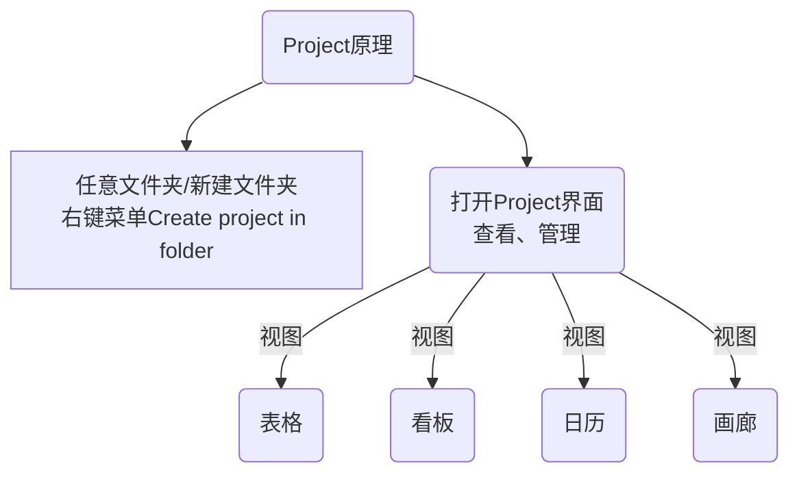

## 1 为什么是obsidian
在obsidian中进行项目管理，非常的方便灵活。
- 丰富的自定义YAML，可以添加任何你想管理的属性
- 在任意的文件夹开始项目管理，自由灵活
- 结合Longform插件，可以很舒服的管理长文的写作进度和灵感
- 项目管理和实际写作整理结合在一起，管理就开始，效率爆棚

## 2 使用 Project 插件管理
Project 是非常不错的插件，安装量  `43,701` ，稳定更新，更新日期很近
::: tip 选择插件的标准
- 安装量大的插件
- 更新稳定、更新很近的插件
:::



## 3 Project 插件使用方法
### 3.1 创建项目
#### 3.1.1 1/2 创建方式
1.   程序右侧边栏图标点击创建- `Open projects`
2.   **在文件列表任意文件夹📁右键， Create project in folder 在文件夹创建项目**（推荐）
3.   命令面板呼出搜索`pro`命令创建
    -   Projects: Show projects，显示项目
    -   Projects: Create new note，创建笔记
    -   Projects: Create new project，**创建项目**

::: tip
推荐安装 `commander` 插件，在右键菜单可以添加 `Projects: Show projects` 命令，显示项目。可在任意页面右键呼出项目管理页面。
:::

#### 3.1.2 2/2 创建示例项目

首次创建项目，点击左上角图标 `Open projects` 创建，按提示创建一个 demo，可以更容易理解项目的意思。

> 弹窗提示 `Get started with Projects`，点击 `Try a demo project` 图标。创建项目演示文件。他会在根目录下创建 `Projects - Demo Project` 文件夹，里面有两个文件 `Projects - Demo Project`、`Projects - Demo Project` 。

-   首先文件夹就是一个项目，文件就是项目中的 note。
-   项目显示的信息是用过笔记文件的 Frontmatter 定义，也就是顶部的 YAML 语法
### 3.2 查看项目
项目面板，有四种显示方法，字面意思很好理解，可点击切换，都是同一数据的不同样式。可自行添加视图

1.  Table ：表格
2.  Board：面板(看板)
3.  Calendar：日历
4.  Gallery：画廊
### 3.3 管理项目
除了首次会有演示项目弹窗外，平时是没有这个的。这个时候我们创建项目有以下几种方式。

1.  左上角图标
2.  命令面板呼出
3.  使用自定义的右键菜单(通过 `commander` 插件安装)
4.  在已经打开的项目面板，点击右上角 `New` 下拉菜单创建。
    -   New project 新的项目
    -   New view 新的视图，就是上面提到的四种展示，表格、
    -   New note 新的笔记
5.  **在文件列表任意文件夹📁右键， Create project in folder 在文件夹创建项目**（推荐）
::: tip 推荐新建-方便管理
**在文件列表任意文件夹📁右键， Create project in folder 在文件夹创建项目**（推荐）
:::
::: tip
通过项目页面可视化的添加项目，添加视图，添加笔记。避免了在文件列表中反复横跳。
:::
### 3.4 给 table 视图增加字段 frontmatter YAML
通过在 frontmatter 中增加 YAML 字段，就可以在 table 视图中增加表头字段了。
#### 3.4.1 1/2 增加默认下拉框

在 table 视图上，点击字段的...三个点图标，选择 Configure field 设置字段。  
添加 Options 这个就是预设的下拉选项。
::: warning
如果在 YAML 中设置二级字段的话，这里 Options 是不会出现的  
Options 只能选择一个，如果需要多个参数的话，还是在 YAML 中输入
:::
#### 3.4.2 2/2增加二级内容

通过 YAML 语法，可以给表头增加内容。二级内容就是增加的标签
```YAML
平台:
  - B站
  - 咖啡豆文档站
```

### 3.5 技巧:编辑项目增加默认模板

项目可以增加默认的模板，新建笔记 note 的时候会自动调用模板。可以在新建项目时设置，也可以随时编辑，方法如下：

打开 Project 图示，在项目的左上角，下拉框会显示项目名称，点击旁边 `...` 图标，📝**Edit project** 编辑图标。

**可以设置：**

-   项目名称、项目路径，
-   打开 `More settings` 更多设置，
    -   可以设置“文件名”使用 `date` 语法。
    -   可以设置“Templates”，选择我们设置好的 `template` 模板文件。

### 3.6 技巧:新建项目文件
建议设计好模板文件，新建文件自动调用模板。打开 Project 后，点击左下角“Add note”。会自动在指定的项目文件夹中新建文件。

### 3.7 技巧:给项目设置过滤项
#### 3.7.1 1/3 加颜色区分
可以加上颜色，给项目过滤显示。可以设置标题包含关键字。多个不同条件可显示不同颜色。
右上角“Color”点击，设置好关键字和颜色即可。
#### 3.7.2 2/3 过滤器筛选
右上角“Filter”过滤器，可以按条件筛选。点开按条件筛选即可。
#### 3.7.3 3/3 隐藏不需要显示的字段
右上角“Hide fields”隐藏字段，打开后开关即可切换隐藏。