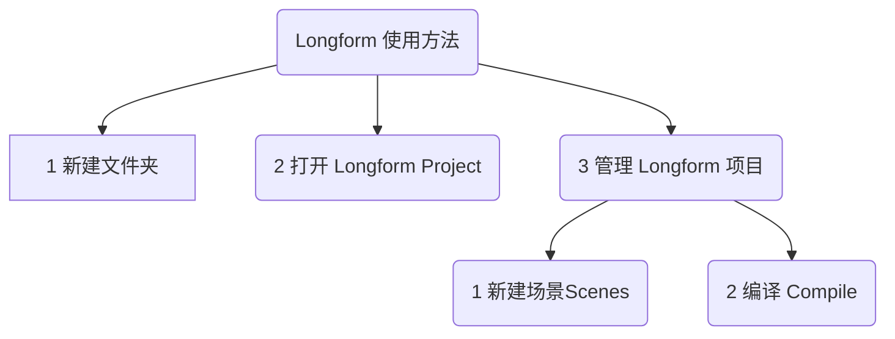

## 1 obsidian 当然能写小说论文长文
obsidian写作长文的时候总是不顺手，我们尝试一种新的方式写作，写攻略、写论文、或者是小说？

当我使用Lattics的时候，对章节的编辑和调整变得很顺滑。我考虑如何在obsidian实现这种功能，当我准备自己动手，学习插件制作的时候。群友推荐了一款 obsidian 插件 Longform 。经过试用，达到我想实现的大部分效果。特整理一篇推文分享给大家。

::: tip 
本文就是在长文写作插件下制作完成，整理思路超级棒
:::

## 2 Longform介绍

Longform 是一个 obsidian 插件，可以帮助你编写和编辑小说、剧本和其他长篇项目。它允许您将一系列笔记或场景组织到有序的手稿。

obsidian 在长文写作上还是非常的不顺手，Longform 插件的概念和我前段时间用的 Lattics 软件很相似。虽然操作没有 Lattics 方便，但是基本上实现了长文组织。

## 3 Longform 优缺点

### 3.1 优点
- 能够为项目单独设置文件夹
- 有单独的界面对 md 文件重新排序
- 可以重组一个**汇总文件**
### 3.2 缺点
- 无法在**汇总文件**中修改，只能在每个单文件中修改，然后重新生成新的**汇总文件**
## 4 Longform 使用方法
### 4.1 新建 Longform 项目
在 Longform 中项目是两种方式存在，一种是多文本，一种是单文本。

::: tip Longform 有两种项目
- 一种是多文本，文件夹中的多个 md 文件，最后合成**汇总文件**
- 一种是单文本，单个 md 文件
:::



#### 4.1.1 首先新建文件夹
首先新建文件夹，文件夹右键“Create Longform Project”，创建专属项目。
#### 4.1.2 打开 Longform Project
点开左上角📖书本图标，打开“Longform Project”项目页。以后的操作都在这个界面。
#### 4.1.3 界面解释
有三个菜单：
- **Scenes**：场景，也就是单个 md 文件，最后合并。
- **Project**：项目信息，标题、目录、文字统计，草稿。
- **Compile**：编译，将多个场景编译为**汇总文件**。默认 Workflow 工作流，也可以自定义流程和正则规则。

### 4.2 管理 Longform 项目
日常使用，在 Longform Project 里就可以了，通过命令 `Longform: Open Longform Pane` 打开面板。

1. 点击**Scenes**新建场景
2. 点击**Compile**编译生成**汇总文件**

::: warning 注意
界面看起来复杂，但实际使用非常的简单，这篇介绍就是使用 Longform 生成
:::

## 5 使用技巧 tips
1. 在 Scenes 中可以拖拽排序，方便管理项目
2. 在 Compile 中可以生成单文件，如果已经有文件了，删除旧文件或者改名生成
3. 在 Project 中可以修改 Longform Project 的名字，也可以看到字数的统计
4. 项目的信息和组织，都在 Longform Project 的 index.md 中
5. 在 Compile 中，选项 `2. Remove Links` 中可以设置 `Remove External Links` 将这个取消，不然文件中的外链都会被清除掉。

::: danger 特别注意：忽略 manuscript.md 文件
- 当生成了 `manuscript.md` 后，在 Scenes 中会识别到新文件，会提示是否添加到项目。
- 这个时候可以选择 `Ignore` 忽略，避免下次生成的时候，把这份文件加到主题上，就会重复了。
:::

### 5.1 技巧:偶尔卡死不能点击 Compile
遇到这种情况，重启一下 obsidian 即可。

### 5.2 技巧:重新 Compile 编译整合文件是直接覆盖
刚试了下，点击 Compile 编译，不会重复生成文件，是会覆盖前面生成的**整合文件**。这点还是很赞的。

::: tip
唯一的不便就是修改整合文件，无法同步单个文件的内容。要找到原始地方在修改
:::
### 5.3 技巧:Scenes 场景提示添加生成文件要忽视
当生成**整合文件**后，在 Scenes 场景中会提示，发现一个新文件，问是否添加到 Scenes 场景中。这个时候要点否，不然会在重编译的时候，重复出现目录。

### 5.4 技巧:两个项目切换不完全
> [!faq] 新建同名文件的时候，会提示已经有一个文件了
> **问题描述**：偶尔发现，在两个项目中切换。并没有真实的切换，新建同名文件的时候，会提示已经有一个文件了。
> **解决方法**：重启 obsidian 会好。

::: tip 新建同名文件的时候，会提示已经有一个文件了
**问题描述**：偶尔发现，在两个项目中切换。并没有真实的切换，新建同名文件的时候，会提示已经有一个文件了。

**解决方法**：重启 obsidian 会好。
:::


### 5.5 技巧:修改编译文件样式去除分割线
整合项目文件，编译的时候，会有一个分割线，比较讨厌。其实这个是可以去除的，在 Compile 面板中。在默认脚本的第4步：Separator 分割器，这里的文件就是
```js
\n\n---\n\n
```

### 5.6 技巧:给 Scenes 面板增加序号
打开 obsidian 插件设置，选择 Longform，第一个 Composition，**Show scene numbers in Scenes tab** 给 Scenes 场景面板增加序号。

::: warning
注意这里的序号可以是二级序号
:::

### 5.7 技巧:Scenes 面板中可添加二级结构
也就是 Scenes 实际上可以有二级目录，在 New Scene 添加后，可拖拽成二级目录。如果开通了显示序号，这里会显示二级序号的。

::: warning
通过面板的拖拽，可以给 Scenes 添加二级目录
:::


### 5.8 技巧:编译时候修改输出文件为项目名称
可以修改输出的文件名为项目名称，设置位置在 Compile 面板，默认工作流拉到最下面，5 Save as Note，设置 Output Path 输出文件路径。原始的是 `manuscript.md`。可修改为项目名称。修改为如下，会生成项目名称的 md 文件。
```js
$1
```
