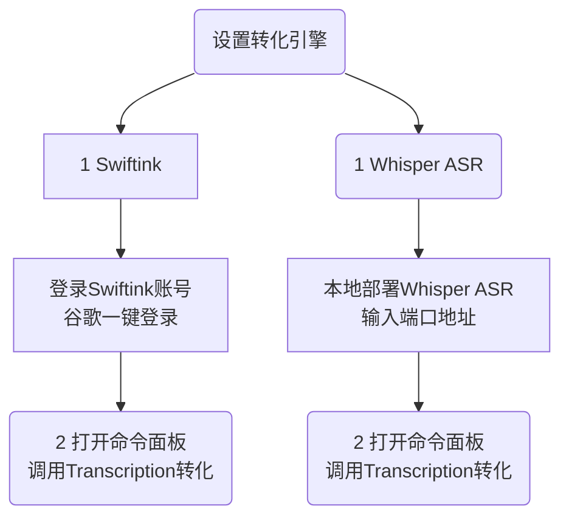

## 1 插件简介
- 插件ID: Transcription
- 作者: djmango
- 描述: 将本地的视频转化为文字
- 仓库地址: djmango/obsidian-transcription

::: tip 一句话介绍用途
`Transcription`是能够将本地视频转化为文字和大纲的插件。适合有保密需求的语音转换。
:::
---

`Transcription`是能够将本地视频转化为文字和大纲的插件，可能需要一定的基础，因为需要安装 `Whisper` 的支持。非常高兴的是，他可以直接使用本地的 `Whisper` 环境，不需要使用 `Whisper API`  。

::: tip 免费的转化
他有两种方式，云端和本地，都是免费的。
- 第一是上传到- [Swiftink.io](https://www.swiftink.io/) - 免费、高质量、域感知语音转文本，
- 第二是使用本地的`Whisper` 环境。免费
:::

所以他是全免费的，只需要你在本地搭建一个`Whisper` 的环境即可，如果你不会的话。可以使用在线版的API，另一个插件可以完成这个。 

>《 [Whisper 语言转文字-耳语](/zh/community-plugins/obsidian-tts.md) Whisper是一个能够将语音转化为文字的项目，来自OpenAI公司的技术API接口》。

::: danger 加群交流
如果在使用和学习中有不明白的地方，或者想看看别人的经验
- 可以查看[进阶用法](/zh/advanced)
- 可以加群和大家聊聊，加微信 `coffeebean1688` 蹦跶的咖啡豆，然后进群
- 可以查看[咖啡豆豆龙_哔哩哔哩](https://space.bilibili.com/618777356)) 视频教程。😜**关注、👍点赞、📀投币一键三连**
- 关注公众号(文章很多)：`蹦跶的咖啡豆
- 关注公众号(文章很多)：`蹦跶的咖啡豆
- 示例库（筹备中）
- 网站启用新域名：https://obsidian.vip 给VIP的你，很好记
:::

::: tip 🌱【点我-扫码加群】
  
::: 
::: details 🍻【点我-打赏】

::: 


## 插件安装
::: tip 插件安装
打开 obsidian → 设置 ⚙️ → 第三方插件 → 社区插件市场，搜索关键字安装

注意：你需要关闭第三方插件的**安全模式**，才能安装社区插件，建议关闭。
:::

## 特点
- 通过 [ffmpeg](https://ffmpeg.org/) 支持多种音频和视频文件格式。
- 灵活的转录引擎 - 云或本地
    - [Swiftink.io](https://www.swiftink.io/) - 免费、高质量、域感知语音转文本
    - [耳语 ASR](https://github.com/ahmetoner/whisper-asr-webservice) - 本地、开源
- 听录每行的开始和结束时间戳
- 一次转录多个文件
- 在后台转录文件
- 每个转录的摘要、大纲和注释，并附

## 插件使用 
就两步，选则引擎并设置，笔记页面启动转化


### 设置Swiftink在线服务
这个会使用 `Swiftink`的在线服务，会上传视频，请注意。不过是免费的。

 . 
- 选择 `Swiftink`
- 选择 `sign in with Google`用谷歌登录，或者 `sign in the GitHub`
- enable timestamp，勾选这个就会允许插入时间戳


### 设置 Whisper ASR
这个是调用了本地的 Whisper ASR 环境，需要你先搭建一个本地的Whisper ASR环境。这个就不在这里展开了，另外开门讲解怎么搭建。其实使用 Docker 搭建，也非常的简单。

 . 

- 选择 `Whisper ASR`
- 在 Whisper ASR URL 这里输入本地Whisper的服务地址，一般你没有修改的话，就是默认的,本地地址加上端口号。
```js
http://localhost:9999
```

### 调用转化
调用非常简单，在任意一个笔记中，已经插入视频的。打开命令面板，输入命令。然后耐心等待就好了。

::: warning 注意
Whisper 的转速速度和你所配置的模型有关系，模型越大准确度越高，然后时间越长。建议选择  `tiny` 或者 `base`模型就可以了。

如果是采用这两个模型的话，可能就是视频的1/10左右的时间会转化完毕。
:::

```js
Transcription: Transcribe all audio files in view
```

 . 

::: danger 加群交流
如果在使用和学习中有不明白的地方，或者想看看别人的经验
- 可以查看[进阶用法](/zh/advanced)
- 可以加群和大家聊聊，加微信 `coffeebean1688` 蹦跶的咖啡豆，然后进群
- 可以查看[咖啡豆豆龙_哔哩哔哩](https://space.bilibili.com/618777356)) 视频教程。😜**关注、👍点赞、📀投币一键三连**
- 关注公众号(文章很多)：`蹦跶的咖啡豆
- 示例库（筹备中）
- 网站启用新域名：https://obsidian.vip 给VIP的你，很好记
:::

::: tip 🌱【点我-扫码加群】
  
::: 
::: tip 🍻【点我-打赏】

::: 