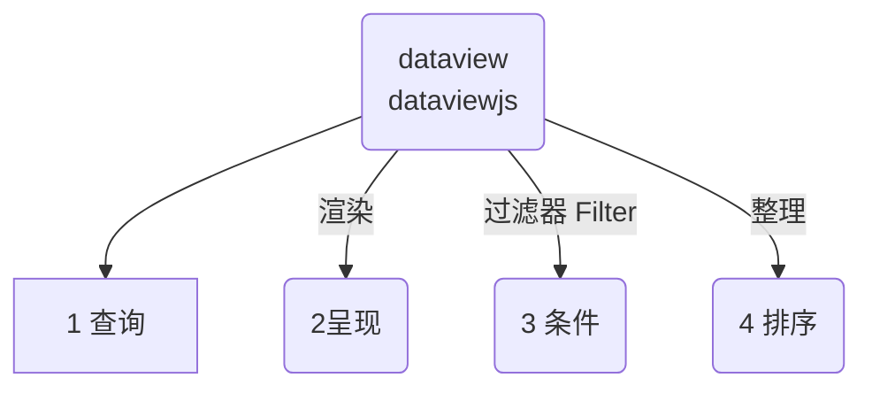
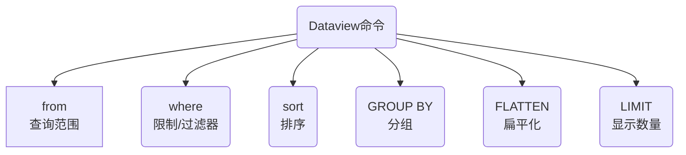

::: tip 更新记录
- 2023-09-19 梳理结构，增加 `dataview` 常用命令大纲
- 2023-09-19 增加命令，`GROUP BY`分组，`FLATTEN`扁平化，`limit` 限制显示数量，
:::
无论 dataview 也好，dataviewjs 也罢，都必须遵循一个逻辑流程：


## 1 dataview常用命令


## 2 From 来源从哪里查
::: tip
首先：指定查询来源，从哪个文件夹，从哪些标签
:::
1. **标签**：从一个或多个标签范围内查询，语法是 `#标签名`，井号不能省略。
2. **文件夹**：从文件夹（及其所有子文件夹）中选择，语法是`"文件夹名"`，双引号不能省略。
3. **单个文件**：查询指定的单个文件，语法是：`文件路径/文件名字.md`
4. **链接**：可以查询链接，指向文件的链接，也可以选择来自文件的所有链接
	1. 要获取链接到 `[[笔记名]]` 的所有页面，请使用 `FROM [[笔记名]]`
	2. 要获取从 `[[笔记名]]` 链接的所有页面（即该文件中的所有链接），请使用 `FROM outgoing([[笔记名]])`

### 2.1 在from里过滤filters
::: warning
很多时候，我们需要进行一定的筛选过滤，
- 比如同时要查文件夹下的某个标签，
- 或者不想要某个标签。
- 或者不想要某个文件。
:::

::: danger 筛选条件
我们可以使用几个条件进行筛选，非常容易理解。  
注意英文符号，前后有一个空格
- `and` ：和，同时满足
- `or` ：或者，任选其一
- `-`：  减去，排除掉这个条件
:::
::: code-tabs
@tab and 同时
```sql
# 查询 文件夹名1 下同时有 #标签名 的数据
from "文件夹名1" and #标签名

# 查询 文件夹名1 和 文件夹名2 ，同时查两个文件夹
from "文件夹名1" and "文件夹2"
```
@tab or 或者
```sql
# 查询 #标签名1 或者 #标签名1 ，任选其中一个
from #标签名1 or #标签名2

# 查询 文件:文件名1 或者 文件:文件名2 中的内容，任选其一
from [[文件名1]] or [[文件名2]]
```
@tab - 排除
```sql
# 查询 文件夹:文件夹名1，并且排除其中带有标签 #标签名1 的文件
from "文件夹名1" - #标签名1

# 查询 文件夹:文件夹名1，并且排除其中的文件:文件名1
from "文件夹名1" - [[文件名1]]
```
:::


## 3 View数据呈现的样式
查询结果可以有四种样式：
 1. **TABLE**: 表格样式，传统的视图类型；每个数据点有一行，有几列的字段数据.
 2. **LIST**: 列表样式，匹配查询的页面的列表。你可以为每个页面输出一个单一的关联值.
 3. **TASK**: 任务列表，页面符合给定查询的任务列表.
 4. **CALENDAR**: 一个日历视图，通过其相关日期上的一个点来显示每一个命中率。
## 4 Where 过滤器-查函数
作为参考SQL的DQL查询，也会使用SQL查询的概念。where 就是一个典型的条件语句。他的作用就是过滤掉符合你要求条件的内容。


::: tip
- 所以你理解为一个过滤器，你指定条件，他帮你过滤内容
- where 后面跟上条件，这里可以使用dataview提供的大量内置函数来实现效果。
:::

::: warning 
- 下面放一些常用的函数，其实常用的就这么写，稍微举几个例子，大家也就清楚了。
- 其他的函数，参考执行就可以。
- 复制这里贴出的代码，严格注意格式，==符号都是英文==
:::

### 4.1 contains() 包含函数
- 对于对象，检查该对象是否有具有给定名称的键
- 对于列表，检查是否有任何数组元素等于给定值
- 对于字符串，检查给定值是否为子字符串
```sql
contains(file.name, "咖啡豆") = true
# 检查对象 file.name ，包含“咖啡豆”，就返回结果为 真
```

### 4.2 实战1:where带contains()函数查询

::: code-tabs
@tab contains语句
```sql
where contains(file.name, "咖啡豆") = true
# 检查对象 file.name ，包含“咖啡豆”，就返回结果为 真

# 1. file.name 是dataview的隐式字段，前面讲到过，还有很多可以拿来查询
# 2. "咖啡豆"  是查询的文字，必须用英文的双引""号包裹
```
@tab 完整查询语句table
```sql
table 
	file.mtime as "修改时间"
from ""
where contains(file.name, "咖啡豆") = true
sort file.name desc

# 用表格显示结果，表头是文件修改时间。
# 从所有的文件里查询
# 过滤条件是：文件名中包含咖啡豆的结果
# 按照文件名排序
# 1. file.name 是dataview的隐式字段，前面讲到过，还有很多可以拿来查询
# 2. "咖啡豆"  是查询的文字，必须用英文的双引""号包裹
```
@tab 完整查询语句list
```sql
list
from ""
where contains(file.name, "咖啡豆") = true
sort file.name desc

# 用列表显示结果
# 从所有的文件里查询
# 过滤条件是：文件名中包含咖啡豆的结果
# 按照文件名排序
# 1. file.name 是dataview的隐式字段，前面讲到过，还有很多可以拿来查询
# 2. "咖啡豆"  是查询的文字，必须用英文的双引""号包裹
```
:::

`file.name`、`file.tags`、`file.path`、`file.folder` 等等众多的隐式字段都可以使用。但是注意有些字段是时间格式，不能错误。

> **参考文档**：[隐式字段](dataview-advanced-a.md#隐式字段)

### 4.3 date(any) 日期函数
从提供的字符串、日期或链接对象中分析日期（如果可能），否则返回nul
```sql
date("2020-04-18") 
# 日期对象代表 2020年4月18日

date([[2021-04-16]])
# 给定页面的日期对象，参考file.day
```

### 4.4 dur(any) 从字符串解析时间
从提供的字符串或持续时间分析**持续时间**，失败时返回null
```sql
dur(8 minutes)
# 8分钟

dur("8 minutes, 4 seconds")
# 8分4秒

dur(dur(8 minutes))
# dur(8 minutes) = <8 minutes>
```

### 4.5 实战2:where带2个函数查询
```sql
list
from ""
WHERE file.mtime >= date(today) - dur(7 day)
sort file.mtime desc
```

```sql
table without id
	file.link as 文件名,
	file.folder as "文件夹",
	file.mtime as 修改时间
from "" and -#obsidian
WHERE file.mtime >= date(today) - dur(7 day)
sort file.mtime desc
limit 20
```


## 5 Where 过滤器-查自定义字段
我们也可以查询自定义字段，也就是前文所讲的 `frontmatter` 和 `inline 内联字段`

> 参考资料：[自定义 Frontmatter前言](dataview-advanced-a.md#自定义Frontmatter前言)


## 6 Sort 排序
按一个或多个字段对所有结果进行排序。

```
SORT date [ASCENDING/DESCENDING/ASC/DESC]
```

```sql
sort file.mtime desc
```

::: tip 排序的方式
- ASC：升序
- DESC：降序
:::

::: danger 加群交流
如果在使用和学习中有不明白的地方，或者想看看别人的经验
- 可以查看[进阶用法](/zh/advanced)
- 可以加群和大家聊聊，加微信 `coffeebean1688` 蹦跶的咖啡豆，然后进群
- 可以查看[咖啡豆豆龙_哔哩哔哩](https://space.bilibili.com/618777356)) 视频教程。😜**关注、👍点赞、📀投币一键三连**
- 关注公众号(文章很多)：`蹦跶的咖啡豆
- 示例库（筹备中）
- 网站启用新域名：https://obsidian.vip 给VIP的你，很好记
:::

## 7 FLATTEN数据扁平化
扁平化是很拗口的一个说法，其实就是将一组数据变成多行数据，每个数据一行，展开方便阅读而已。

::: warning 概念
打个比方：一个Excel的数据，有多列，现在按照某一列的数据，展示出来，展示的结果是一个数据占一行
:::

::: tip 举例
展平每个书籍注释中的 `作者` 字段，为每个作者放一行
:::

什么时候使用？

::: code-tabs#实战1
@tab 基础查询语法#id11
````markdown
```dataview
TABLE 作者 
FROM #书籍 
FLATTEN 作者
```
````
:::

::: code-tabs#实战1
@tab 结果演示#id11
````markdown
| 书名                  | 作者         | 出版日期     | 出版社     | 价格      |
|-----------------------|--------------|--------------|------------|-----------|
| 阳光下的快乐笔记        | 欢快小编     | 2023-03-15   | 欢乐出版社 | $20.00    |
| 欢笑的故事集           | 笑声大师     | 2022-11-10   | 快乐出版社 | $18.50    |
| 快乐的文字游戏         | 文字欢喜人   | 2023-05-20   | 欢乐文化   | $22.99    |
| 欢快心情的诗歌         | 欢歌诗人     | 2022-09-08   | 欢歌出版   | $15.75    |
| 欢跳的小说世界         | 欢乐作家     | 2023-01-30   | 欢跳出版   | $24.99    |
````

:::

查询结果示例：

| 文件名称                  | 作者         |
|-----------------------|--------------|
| 阳光下的快乐笔记        | 欢快小编     |
| 欢笑的故事集           | 笑声大师     |
| 快乐的文字游戏         | 文字欢喜人   |
| 欢快心情的诗歌         | 欢歌诗人     |
| 欢跳的小说世界         | 欢乐作家     |

## 8 GROUP BY 数据分组
这是一个很有意思的命令，当你查询出来的数据想按照一定的要求分组显示。就可以使用。

比如在 list 视图下面，
- 将结果按照不同的日期分组显示
- 将结果按照不同的文件夹展示
- 将结果按照不同的文件路径展示
- 其他的参数
	- `file.name` 文件名称
	- `file.cday` 文件创建日期
	- `file.mday` 文件修改日期
- 

::: code-tabs#实战2
@tab list视图/按照文件夹分组#id22
````sql
list rows.file.link
from "Longform"
where file.name != "Index"
GROUP BY file.folder
````
:::

::: code-tabs#实战2
@tab list视图/按照文件夹分组#id22
````markdown
按照 list 展示，并加上参数 row.file.link 文件链接
从 Longform 文件夹查询
where 限制条件：不允许文件名中包含 Index 的文件
分组展示，按照 file.folder 文件夹
````

:::


::: tip 注意：这里有个小技巧
- list 视图，我们追加了显示，在原有显示的基础上增加了 `row.file.link`，这一句会增加一个文件的链接。
- 因为我们使用了 `GROUP BY` 分组之后，会失去文本的链接，所以需要使用上面的语法增加链接。
:::

> 对于[ list 追加显示](/zh/dataview/dataview-advanced-e.md) 的方法，可以看这篇文章

## 9 limit限制显示数量
当你查询的数据过多的时候，可能不想显示太多的内容。那么我们可以控制显示数据的数量，比如只显示10个。语法简单，不多赘述

```
limit 10
```