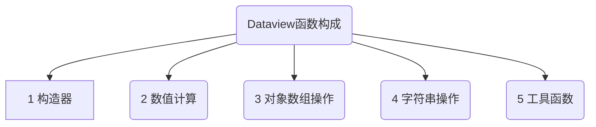
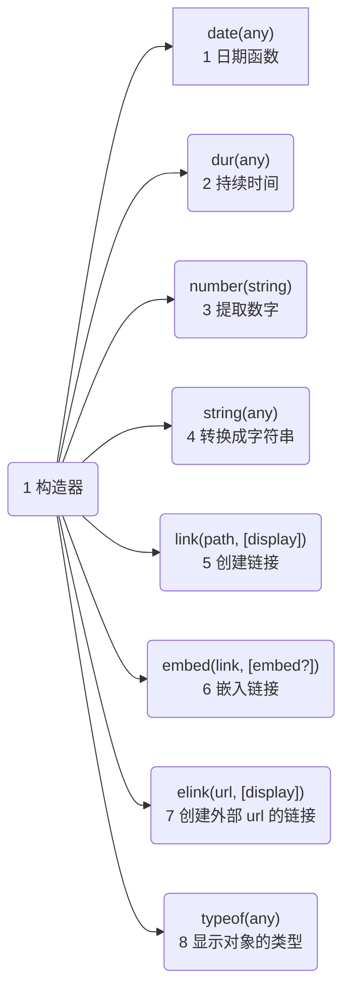
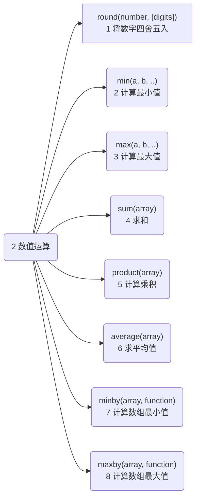
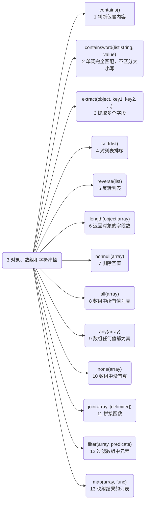
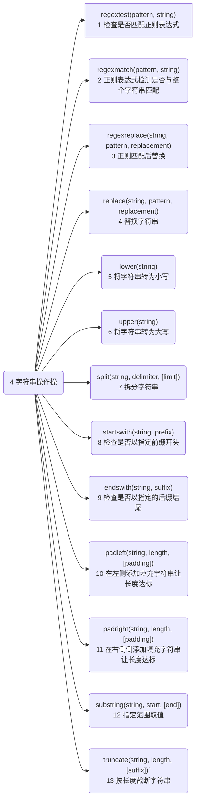
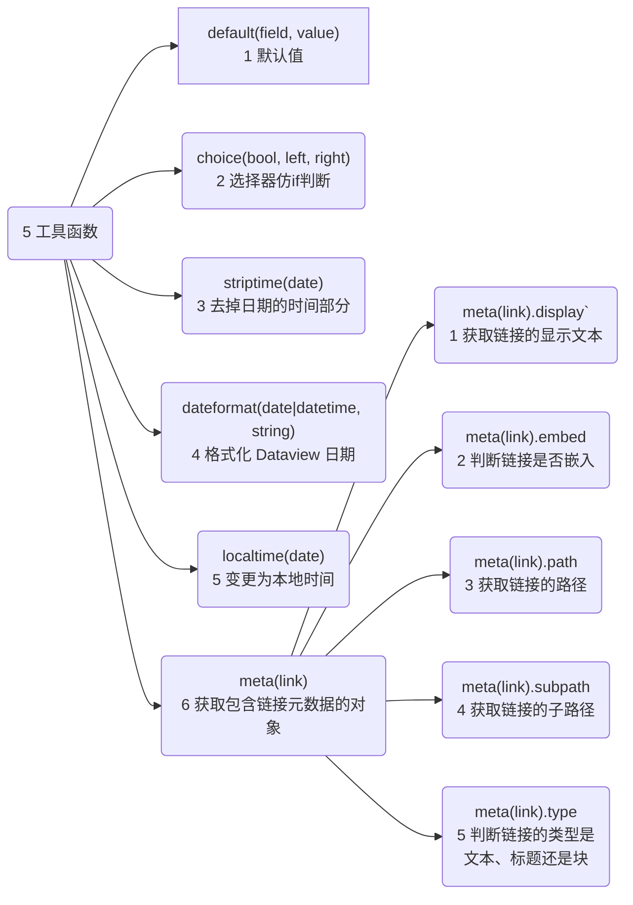

---
# 这是文章的标题
title: Dataview函数集合
# 这是侧边栏的顺序
order: 3
# 这是页面的图标
icon: activity
# 控制左侧显示层数(只显示2层)，但是右侧会显示3级
headerDepth: 2
---
**说明：**  
这里记录 dataview 可使用的一些函数供参考
::: tip Dataview 函数的用途
Dataview 函数提供了更高级的数据操作方法，可以在除了`From`之外的地方，使用函数来过滤信息。得到更灵活的查询数据.
:::

函数主要是在`where`中使用，可以直接使用，也可以嵌套使用以下的函数实现更灵活的用法。


::: details 🏆各函数大纲-点击展开
::: tabs
@tab:active 🥕1 构造器-
<!-- :active 将被默认激活-->

@tab 🍊2 数值运算
<!-- tab 2 内容 --> 

@tab 🥒3 对象、数组和字符串操作
<!-- tab 3 内容 -->

@tab 🍉4 字符串操作

@tab 🥭5 工具函数

:::
::: danger 本文档使用方法(必看)
函数是在太多太长了，页面不利于阅读。所以整理出5种功能函数的大纲图。  
从`大纲图`，更容易看结构，知道有哪些内容。
需要查阅对应内容，复制`大纲图`中的函数名在本页搜索关键字：`Ctrl` + `F` 
:::
## 1 Constructors 构造器
新建值的构造函数
::: danger 构造器
非程序员，这个概念可不用理会，单纯的为了分类。下面的函数照格式用就可以，不用深究。
:::
::: details 1 构造器-大纲(点击展开)

:::
### 1.1 `date(any)`日期函数
如果可能，从提供的字符串、日期或链接对象中解析日期，否则返回 null。
```js
date("2020-04-18") //日期对象，代表2020年4月18日
date([[2021-04-16]]) //指定页面的日期对象，参考file.day
```
### 1.2 `dur(any)`持续时间
从提供的字符串或持续时间解析持续时间，失败时返回 null。
```js
dur(8 minutes) //8 分钟
dur("8 minutes, 4 seconds")  // 8 分钟, 4 分钟 
dur(dur(8 minutes)) = dur(8 minutes) //8 分钟
```
::: tip 日期的计算示例
大家经常会想查询，一个时间范围内的文件。这可以使用以上两个函数。
- 获取今天的时间：`data(today)`表示获取今天的日期类似 2023-02-11。
- 获取一个持续时间：`dur(7 days)` 表示从7 days 获取一个时间，就是7天，转化成可计算的
- dataview的隐式字段，`file.cday`获取文件创建的日期类似 2023-02-10。
- 以下的列子是：使用相同类型的数据计算，data(today) - file.cday 今天减去文件创建的时间，小于等于7天。
:::

::: code-tabs
@tab 7天内创建的文件
```sql
where date(today) - file.cday <= dur(7 days)
```
@tab:active 7天内创建的文件-表格有表头
```sql
table without id
		语言,
 		框架,
		简述,
		file.cday AS "创建日期"
from "099 Code snippet"
where date(today) - file.cday <=dur(7 days)
sort file.cday desc
limit 15
```
@tab 7天内创建的文件-列表显示
```sql
list
from "099 Code snippet"
where date(today) - file.cday <=dur(7 days)
sort file.cday desc
```
:::

### 1.3 `number(string)` 提取数字
如果字符串中有数字，则返回第一串数字。  
如果字符串中没有数字，则返回 null。
```js
number("18 years") //结果为 18 
number(34) //结果为 34 
number("hmm") //结果为 null
```
### 1.4 `string(any)` 转换成字符串
将任何值转换为“合理的”字符串表示形式。它主要用于将日期、持续时间、数字等强制转换为字符串以进行操作。
::: tip 字符串格式
其实就是将其他格式的值转成字符串格式，相反例子，2023-02-09这种字符串不能直接进行计算，要转换成日期或者数字才行。
:::
```js
string(18) //字符串 18
string(dur(8 hours)) //字符串 8 hours 
string(date(2021-08-15)) //字符串 2021年8月15日
```
### 1.5 `link(path, [display])` 创建链接
从指定的文件路径或名称构造一个链接对象。如果提供两个参数，则第二个参数是链接的显示名称。`link(路径,显示名称)`
```js
link("Hello") //链接到名为 "Hello "的页面
link("Hello", "Goodbye") //链接到名为 "Hello "的页面，显示为 "Goodbye"。
```
> 类似于：`[[]]`

### 1.6 `embed(link, [embed?])`嵌入链接
将 link 链接对象转换为 embed 嵌入链接；对嵌入式链接的支持在 Dataview 视图中有些不完善，但图像嵌入应该可以工作。
```js
embed(link("Hello.png")) 
```
::: tip 
- 嵌入 链接到 "Hello.png "的图像，这将呈现为一个实际的图像。
- 类似于 `![[hello.png]]` 的语法调用
:::

### 1.7 `elink(url, [display])`创建外部 url 的链接
创建指向外部 url 的链接（如 `www.google.com` ）。如果提供两个参数，则第二个参数是链接的显示名称。
>`elink(链接, 显示名称)`，第二个参数非必须
```JS
elink("www.google.com") //创建一个链接到 www.google.com
elink("www.google.com", "Google") //创建一个链接到 www.google.com，显示为 Google
```
类似于语法：`[obsidian咖啡豆文档](https://www.coffeetea.top)`
举例：[obsidian咖啡豆文档](https://www.coffeetea.top)
### 1.8 `typeof(any)`显示对象的类型
获取要检查的任何对象的类型。可以与其他运算符结合使用以根据类型更改行为。
::: tip 为什么要查数据的类型
有时候我们也不知道数据的类型，也需要打印出来数据的类型。方便调用不同的方式处理对象。
:::
```js
typeof(8) //"number" 数字
typeof("text") // "string" 字符串
typeof([1, 2, 3]) // "array" 数组
typeof({ a: 1, b: 2 }) // "object" 对象
typeof(date(2020-01-01)) // "date" 日期 
typeof(dur(8 minutes)) // "duration" 持续时间
```

## 2 Numeric Operations 数值运算
::: danger 使用方法
推荐展开下面的大纲，查看你需要的函数，在选择使用。
:::
::: details 🥕2 数值运算大纲(点击展开)

:::
### 2.1 `round(number, [digits])`将数字四舍五入
将数字四舍五入到指定的位数。
- 如果未指定第二个参数，则舍入到最接近的整数；
- 否则，四舍五入到指定的位数。
```js
round(16.555555) //结果为 17 
round(16.555555, 2) //结果为 16.56
```
### 2.2 `min(a, b, ..)`计算最小值
计算参数列表或数组的最小值。
```js
min(1, 2, 3) //结果为 1 
min([1, 2, 3]) //结果为 1  
min("a", "ab", "abc") //结果为 "a"
```
### 2.3 `max(a, b, ...)`计算最大值
计算参数列表或数组的最大值。
```js
max(1, 2, 3) //结果为 3 
max([1, 2, 3]) //结果为 3  
max("a", "ab", "abc") //结果为 "abc"
```
### 2.4 `sum(array)`求和
对数组中的所有数值求和。如果平均值中有空值，则可以通过 `nonnull` 函数消除它们。
```js
sum([1, 2, 3]) //结果为 6 
sum([]) //结果为 null 空
sum(nonnull([null, 1, 8])) //结果为 9
```
::: tip `sum(array)`求和
说明：
- `sum()`是求和的函数，中间的值是数组
- `nonnull([null, 1, 8])`是一个函数，输出的值是清除空值的数组。
- 所以，`sum(nonnull([null, 1, 8]))`是组合使用。很容易理解。注意符号要成对，用英文就可以了
:::
### 2.5 `product(array)`计算乘积
计算数组的乘积。如果平均值中有空值，则可以通过 `nonnull` 函数消除它们。
```js
product([1,2,3]) //结果为 6 
product([]) //结果为 null  
product(nonnull([null, 1, 2, 4])) //结果为 8
```
::: tip `sum(array)`求和
说明：
- `product()`是计算乘积的函数，中间的值是数组
- `nonnull([null, 1, 2, 4])`是一个函数，输出的值是清除空值的数组。
- 所以，`sum(nonnull([null, 1, 2, 4]))`是组合使用。很容易理解。注意符号要成对，用英文就可以了
:::
### 2.6 `average(array)`求平均值
计算数值的数值平均值。如果平均值中有空值，则可以通过 `nonnull` 函数消除它们。
```js
average([1, 2, 3]) //结果为 2 
average([]) //结果为 null  
average(nonnull([null, 1, 2])) //结果为 1.5
```
- `nonnull()`是一个函数，输出的值是清除空值的数组。
- `average()`是一个求平均值的函数。可以求`average(nonnull()) `的结果。
### 2.7 `minby(array, function)`计算数组最小值
使用提供的函数计算数组的最小值。
```js
minby([1, 2, 3], (k) => k) //结果为 1 
minby([1, 2, 3], (k) => 0 - k) //结果为 3  
minby(this.file.tasks, (k) => k.due) //结果为 最早到期的
```
### 2.8 `maxby(array, function)`计算数组的最大值
使用提供的函数计算数组的最大值。
```js
maxby([1, 2, 3], (k) => k) //结果为 3 
maxby([1, 2, 3], (k) => 0 - k) //结果为 1  
maxby(this.file.tasks, (k) => k.due) //结果为 最晚到期的
```
## 3 对象、数组和字符串操作
操作容器对象内部值的操作。
::: danger 使用方法
推荐展开下面的大纲，查看你需要的函数，在选择使用。
:::
::: details 🥕3 对象、数组和字符串操作大纲(点击展开)

:::
### 3.1 `contains()` and friends 判断包含内容
为了快速总结，这里有一些例子：
```js
contains("Hello", "Lo") = false   //表示没有包含，返回值为假 false
contains("Hello", "lo") = true    // 表示包含了，返回值为真 true
icontains("Hello", "Lo") = true   
icontains("Hello", "lo") = true    
econtains("Hello", "Lo") = false  
econtains("Hello", "lo") = true   
econtains(["this","is","example"], "ex") = false
econtains(["this","is","example"], "is") = true
```
::: tip
- 很常用的函数，判断容器内是否有指定的值  
- 返回值为布尔值，true/false 。就是真/假
:::
#### 01 `contains(object|list|string, value)`判断包含值
🍊检查指定的**容器**类型**是否具有指定的值**。
- 根据第一个参数是对象、列表还是字符串，此函数的行为略有不同。
- 此函数**区分大小写**。  
**几种情况：**  
- a.对于**对象**🥕，检查对象是否具有指定名称的键。例如， 
```js
contains(file, "ctime") = true 
contains(file, "day") = true (if file has a date in its title, false otherwise)
```
- b.对于**列表**🥒，检查是否有任何数组元素等于指定值。例如，
```js
contains(list(1, 2, 3), 3) = true //返回值为真 true
contains(list(), 1) = false       //返回值为假 false
```
- c.对于**字符串**🍌，检查指定值是否是字符串的子字符串（即内部）。
```js
contains("hello", "lo") = true 
contains("yes", "no") = false
```
::: warning 示例
这是一个使用率很高的函数，我们可以这样用：
- 查找文件标题中，包含“咖啡豆文档”的文件：`contains(file.name, "ctime")`
- 对象，可以是隐式字段中的内容。可查阅[隐式字段文档](/zh/advanced/dataview进阶(1).md#隐式字段)
:::
::: code-tabs
@tab 简单示例
```sql
where contains(file.name, "咖啡豆文档") = true
```
@tab:active 文件名中包含“关键字”
```sql
table 
	file.mtime as "修改时间"
from ""
where contains(file.name, "咖啡豆文档") = true
sort file.name desc
```
@tab 文件名 不包含 “关键字”
```sql
table 
	file.mtime as "修改时间"
from ""
where !contains(file.name, "咖啡豆文档") = true
sort file.name desc
```
@tab 标签中包含“关键字”
```sql
table 
	file.mtime as "修改时间"
from ""
where contains(file.tags, "咖啡豆文档") = true
sort file.name desc
```
@tab frontmatter中包含“关键字”
```sql
table 
	file.mtime as "修改时间",
	file.name as "文件名"
from ""
where contains(file.frontmatter, "语言") = true
sort file.name desc
```
:::
::: tip 用!取反
- 用`!`感叹号，表示否定的意思，比如这里是 `!contains()` 表示不包含
- 也可以用`flase`表示否定，`where contains(file.tags, "咖啡豆文档") = flase`
- 布尔值真假，也就是`true`和`flase`，他们是对应关系，经常用来判断条件是否成立。
:::


#### 02 `icontains(object|list|string, value)`判断包含值(不区分大小写)
`contains()` 的不区分大小写的版本。
#### 03 `econtains(object|list|string, value)`判断完全匹值(区分大小写)
**exact match 精确包含**：检查是否在<u>字符串</u>/<u>列表</u>中找到**完全匹配**。此函数区分大小写。
- 对于字符串🍌，它的行为与 `contains()` 完全一样。
```js
econtains("Hello", "Lo") = false  //返回值为假 false    
econtains("Hello", "lo") = true  //返回值为真 true
```
 - 对于列表🥒，它会检查确切的单词是否在列表中。
```js
econtains(["These", "are", "words"], "word") = false  //返回值为假 false   
econtains(["These", "are", "words"], "words") = true  //返回值为真 true  
```
-  对于对象🥕，它检查对象中是否存在确切的键名。它不进行递归检查。
```js
econtains({key:"value", pairs:"here"}, "here") = false  //返回值为假 false    
econtains({key:"value", pairs:"here"}, "key") = true   //返回值为真 true
econtains({key:"value", recur:{recurkey: "val"}}, "value") = false  //返回值为假 false   
econtains({key:"value", recur:{recurkey: "val"}}, "Recur") = false   //返回值为假 false   
econtains({key:"value", recur:{recurkey: "val"}}, "recurkey") = false  //返回值为假 false   
```
### 3.2 `containsword(list|string, value)`单词完全匹配，不区分大小写
检查值 `value` 是否与字符串 `string` 或列表 `list` 中的单词**完全匹配**。
- 这是不区分大小写的。
- 对于不同类型的输入，输出是不同的，请参见示例。
**分类**  
- 对于字符串🍌，它检查指定字符串中是否存在该词。
```js
containsword("word", "word") = true // 返回值为真 true  
containsword("word", "Word") = true // 返回值为真 true  
containsword("words", "Word") = false // 返回值为假 false  
containsword("Hello there!, "hello") = true // 返回值为真 true  
containsword("Hello there!, "HeLLo") = true // 返回值为真 true  
containsword("Hello there chaps!, "chap") = false  // 返回值为假 false  
containsword("Hello there chaps!, "chaps") = true // 返回值为真 true  
```
- 对于列表🥒，它返回一个布尔值列表，指示是否找到单词的**不区分大小写**的精**确匹配**项。    
```js
containsword(["I have no words.", "words"], "Word") = [false, false]  
containsword(["word", "Words"], "Word") = [true, false]   
containsword(["Word", "Words in word"], "WORD") = [true, true]
```
### 3.3 `extract(object, key1, key2, ...)`提取多个字段
从一个对象中提取多个字段，创建一个仅包含这些字段的新对象。
```js
extract(file, "ctime", "mtime") = object("ctime", file.ctime, "mtime", file.mtime) 
extract(object("test", 1)) = object()
```
### 3.4 `sort(list)`对列表排序
对列表🥒进行排序，按排序顺序返回新列表。
```js
sort(list(3, 2, 1)) = list(1, 2, 3)   
sort(list("a", "b", "aa")) = list("a", "aa", "b")
```
### 3.5 `reverse(list)`反转列表
反转列表，以相反的顺序返回新列表。
```js
reverse(list(1, 2, 3)) = list(3, 2, 1) 
reverse(list("a", "b", "c")) = list("c", "b", "a")
```
### 3.6 `length(object|array)`返回对象的字段数
返回对象中的字段数，或数组中的条目数。
```js
length([]) = 0 // 获取数组中的条目，是0条
length([1, 2, 3]) = 3 // 获取数组中的条目，是3条
length(object("hello", 1, "goodbye", 2)) = 2 //对象中的字段数
```
### 3.7 `nonnull(array)`删除空值
返回一个删除了所有空值的新数组。
::: tip 常用函数
删除所有空值，并返回一个数组。  
用于清洗数据
:::
```js
nonnull([]) = [] 
nonnull([null, false]) = [false] 
nonnull([1, 2, 3]) = [1, 2, 3]
```
### 3.8 ⏰`all(array)`数组中所有值为真
- 仅当数组中的所有值都为真时才返回 `true` 。
- 您还可以将多个参数传递给此函数，在这种情况下，它仅在所有参数都为真时才返回 `true` 。
```js
all([1, 2, 3]) = true   // 返回值为真 true  
all([true, false]) = false   // 返回值为假 false  
all(true, false) = false   // 返回值为假 false  
all(true, true, true) = true  // 返回值为真 true  
```
您可以将函数作为第二个参数传递，以便仅当数组中的所有元素都与==谓词==匹配时才返回 true。
```js
all([1, 2, 3], (x) => x > 0) = true // 返回值为真 true  
all([1, 2, 3], (x) => x > 1) = false // 返回值为假 false  
all(["apple", "pie", 3], (x) => typeof(x) = "string") = false
```
**解读：**  
- 首先：`(x) => x > 0`  这是一个箭头函数， 左边是参数，右边是表达式，根据左边的参数计算右边表达式的结果。
- 然后，当`[列表]`列表中的数值，依次去对比，就是`(1) => x > 0`，返回真，2,3都是真，则all函数也返回真 。
- 然后，以上第二个，从列表中做为参数，`(1) => x > 1` 参数是1，计算x >1 为假。因此all函数只能返回假，因为不是所有的值都为真。

::: tip 谓词（predicate）
- SQL 谓词就是返回值为 `TRUE`、`FALSE` 或 `UNKNOWN` 的**表达式**。
- =、<、>、<> 等比较运算符，其正式的名称就是比较谓词
- 通俗来讲谓词就是 SQL 常用的函数 中介绍的函数中的一种，是需要满足特定条件的函数，该条件就是返回值是真值。
- 对通常的函数来说，返回值有可能是数字、字符串或者日期等，但是谓词的返回值全都是真值（TRUE/FALSE/UNKNOWN）。这也是谓词和函数的最大区别。
:::
::: tip =>箭头函数
(a, b) => a + b 表示一个函数接受两个名为 a 和 b 的参数。
在执行时，它将对表达式 **a + b 求值**，并返回计算结果

语法：==(参数) => 表达式==  
- 右侧是一个表达式：函数计算表达式并返回其结果
- 如果只有一个参数，则可以省略括号，例如 `n => n*2`
:::

### 3.9 `any(array)`数组任何值都为真
如果数组中的**任何值都为真**，则返回 `true` 。
您还可以将多个参数传递给此函数，在这种情况下如果任何参数为真，它会返回 `true` 。
```js
any(list(1, 2, 3)) = true // 返回值为真 true  
any(list(true, false)) = true // 返回值为真 true  
any(list(false, false, false)) = false // 返回值为假 false  
any(true, false) = true // 返回值为真 true  
any(false, false) = false// 返回值为假 false  
```
您可以将函数作为第二个参数传递，以便仅当数组中的任何元素与**谓词**匹配时才返回 true。
```js
any(list(1, 2, 3), (x) => x > 2) = true // 返回值为真 true  
any(list(1, 2, 3), (x) => x = 0) = false// 返回值为假 false  
```
### 3.10 ⏰`none(array)`数组中没有真
如果数组中没有任何值是真，则返回 `true` 。
```js
none([]) = true // 返回值为真 true  
none([false, false]) = true // 返回值为真 true  
none([false, true]) = false // 返回值为假 false  
none([1, 2, 3]) = false// 返回值为假 false  
```

您可以将函数作为第二个参数传递，以便仅在数组中没有元素与**谓词**匹配时才返回 true。
```js
none([1, 2, 3], (x) => x = 0) = true // 返回值为真 true  
none([true, true], (x) => x = false) = true // 返回值为真 true  
none(["Apple", "Pi", "Banana"], (x) => startswith(x, "A")) = false// 返回值为假 false  
```
::: tip 谓词（predicate）
- SQL 谓词就是返回值为 `TRUE`、`FALSE` 或 `UNKNOWN` 的**表达式**。
- =、<、>、<> 等比较运算符，其正式的名称就是比较谓词
- 通俗来讲谓词就是 SQL 常用的函数 中介绍的函数中的一种，是需要满足特定条件的函数，该条件就是返回值是真值。
- 对通常的函数来说，返回值有可能是数字、字符串或者日期等，但是谓词的返回值全都是真值（TRUE/FALSE/UNKNOWN）。这也是谓词和函数的最大区别。
:::
### 3.11 `join(array, [delimiter])`拼接函数
将数组中的元素连接成单个字符串（即，将它们全部呈现在同一行上）。
- 如果提供第二个参数，则每个元素将由指定的分隔符分隔。
```js
join(list(1, 2, 3)) = "1, 2, 3"  // 将list中的元素拼接成单个字符
join(list(1, 2, 3), " ") = "1 2 3" // 将list列表中的元素拼接，使用空格分隔
join(6) = "6" 
join(list()) = ""
```
### 3.12 ⏰`filter(array, predicate)`过滤数组中元素

根据谓词过滤数组中的元素，返回匹配元素的新列表。
```js
filter([1, 2, 3], (x) => x >= 2) = [2, 3] 
filter(["yes", "no", "yas"], (x) => startswith(x, "y")) = ["yes", "yas"]
```

**解读**：第一个示例    
- `filter([1, 2, 3], (x) => x >= 2) = [2, 3] `
- 根据谓词过滤数组中的元素，谓词是箭头函数的表达式是 `x >=2` ，那么1,2,3 分别当参数。最后留下来[2,3]。

**解读**：第二个示例    
- `filter(["yes", "no", "yas"], (x) => startswith(x, "y")) = ["yes", "yas"]` 
- `(x)`是参数，后面是表达式startswith(x, "y") ，x参数中用`y`开头的数据

::: tip 谓词（predicate）
- SQL 谓词就是返回值为 `TRUE`、`FALSE` 或 `UNKNOWN` 的**表达式**。
- =、<、>、<> 等比较运算符，其正式的名称就是比较谓词
- 通俗来讲谓词就是 SQL 常用的函数 中介绍的函数中的一种，是需要满足特定条件的函数，该条件就是返回值是真值。
- 对通常的函数来说，返回值有可能是数字、字符串或者日期等，但是谓词的返回值全都是真值（TRUE/FALSE/UNKNOWN）。这也是谓词和函数的最大区别。
:::
### 3.13 ⏰`map(array, func)`映射结果的列表❓
Applies the function to each element in the array, returning a list of the mapped results.  
将函数应用于数组中的每个元素，返回映射结果的列表。
```js
map([1, 2, 3], (x) => x + 2) = [3, 4, 5] 
map(["yes", "no"], (x) => x + "?") = ["yes?", "no?"]
```
---
## 4 String Operations 字符串操作
::: danger 使用方法
推荐展开下面的大纲，查看你需要的函数，在选择使用。
:::
::: details 🥕4 字符串操作操作大纲(点击展开)

:::
### 4.1 `regextest(pattern, string)`检查是否匹配正则表达式
检查是否可以在字符串中找到指定的正则表达式模式（使用 JavaScript 正则表达式引擎）。

::: warning 可以只匹配文本的一部分
- 返回值是布尔值，就是 true 或者 false ，真或者假
- 可以只匹配文本的一部分
:::
```js
regextest("\w+", "hello") = true // 返回值为真 true  
regextest(".", "a") = true // 返回值为真 true  
regextest("yes|no", "maybe") = false // 返回值为假 false  
regextest("what", "what's up dog?") = true// 返回值为真 true  
```
### 4.2 `regexmatch(pattern, string)`正则表达式检测是否与整个字符串匹配
使用 JavaScript 正则表达式引擎检查指定的**正则表达式**模式是否与**整个字符串匹配**。这与 `regextest` 的不同之处在于 **regextest 可以只匹配文本的一部分**。
::: warning 必须匹配整个字符
这个必须匹配整个字符，不可以只匹配一部分。匹配一部分可以用 regextest
:::
```js
regexmatch("\w+", "hello") = true // 返回值为真 true  
regexmatch(".", "a") = true // 返回值为真 true  
regexmatch("yes|no", "maybe") = false // 返回值为假 false  
regexmatch("what", "what's up dog?") = false// 返回值为假 false  
```
### 4.3 `regexreplace(string, pattern, replacement)`正则匹配后替换
将正则表达式 `pattern` 在 `string` 中匹配的所有实例替换为 `replacement` 。这在底层使用了 JavaScript 替换方法，因此您可以使用 `$1` 等特殊字符来引用第一个捕获组，等等。
::: tip 正则匹配后替换
就是用**正则表达式匹配**之后替换字符串
:::

```js
regexreplace("yes", "[ys]", "a") = "aea" 
regexreplace("Suite 1000", "\d+", "-") = "Suite -"
```
### 4.4 `replace(string, pattern, replacement)`替换字符串
将 `string` 中的所有 `pattern` 实例替换为 `replacement` 。
::: tip 普通匹配后替换
普通匹配之后替换字符串
:::
```js
replace("what", "wh", "h") = "hat" 
replace("The big dog chased the big cat.", "big", "small") = "The small dog chased the small cat." 
replace("test", "test", "no") = "no"
```
### 4.5 `lower(string)`将字符串转为小写
将字符串全部转为小写。(字面意思)
```js
lower("Test") = "test" 
lower("TEST") = "test"
```
### 4.6 `upper(string)`将字符串转为大写
将字符串转换为全部大写。(字面意思)
```js
upper("Test") = "TEST" 
upper("test") = "TEST"
```
### 4.7 `split(string, delimiter, [limit])`拆分字符串

按指定的分隔符去拆分字符串。
- 如果提供了第三个参数，它会限制发生的拆分次数。
- 分隔符字符串被解释为正则表达式。  
如果分隔符中有捕获组，则匹配的拼接成结果数组，不匹配的捕获为空串。
```js
split("hello world", " ") = list("hello", "world") 
split("hello  world", "\s") = list("hello", "world") 
split("hello there world", " ", 2) = list("hello", "there") 
split("hello there world", "(t?here)") = list("hello ", "there", " world") 
split("hello there world", "( )(x)?") = list("hello", " ", "", "there", " ", "", "world")
```
### 4.8 `startswith(string, prefix)`检查是否以指定前缀开头
检查字符串是否以指定前缀开头。
```js
startswith("yes", "ye") = true // 返回值为真 true  
startswith("path/to/something", "path/") = true // 返回值为真 true  
startswith("yes", "no") = false // 返回值为假 false  
```
### 4.9 `endswith(string, suffix)`检查是否以指定的后缀结尾
检查字符串是否以指定的后缀结尾。
```js
endswith("yes", "es") = true 
endswith("path/to/something", "something") = true 
endswith("yes", "ye") = false
```
### 4.10 `padleft(string, length, [padding])`在左侧添加填充字符串让长度达标

通过在左侧添加填充来将字符串填充到所需的长度。如
- 果省略填充字符，默认情况下将使用空格。
```js
padleft("hello", 7) = "  hello" 
padleft("yes", 5, "!") = "!!yes"
```
### 4.11 `padright(string, length, [padding])`在右侧侧添加填充字符串让长度达标
等同于 `padleft` ，但改为向右填充。
```js
padright("hello", 7) = "hello  " 
padright("yes", 5, "!") = "yes!!"
```
### 4.12 `substring(string, start, [end])`指定范围取值
取一段字符串，从 `start` 开始到 `end` 结束（如果未指定，则为字符串的末尾）。
```js
substring("hello", 0, 2) = "he" 
substring("hello", 2, 4) = "ll" 
substring("hello", 2) = "llo" 
substring("hello", 0) = "hello"
```
### 4.13 `truncate(string, length, [suffix])`按长度截断字符串
将字符串截断为最多指定长度，包括 `suffix` （默认为 `...` ）。通常用于切断表格中的长文本。
```js
truncate("Hello there!", 8) = "Hello..." 
truncate("Hello there!", 8, "/") = "Hello t/" 
truncate("Hello there!", 10) = "Hello t..." 
truncate("Hello there!", 10, "!") = "Hello the!" 
truncate("Hello there!", 20) = "Hello there!"
```
## 5 Utility Functions 工具函数
::: tip 所谓工具函数
为了准确表达这个概念，专门研究了一些资料，总结概念如下：  
Utility Functions 是个约定俗成的用法，在开发语境下，其复数形式表达与某个业务流/应用相关的**工具集**，也就是**工具箱**的含义。
:::
::: danger 使用方法
推荐展开下面的大纲，查看你需要的函数，在选择使用。
:::
::: details 🥕5 工具函数-操作大纲(点击展开)

:::
### 5.1 ⏰`default(field, value)` 默认值

如果 `field` 为空，则返回 `value` ；否则返回 `field` 。用于用默认值替换空值。
- 例如，要显示尚未完成的项目，请使用 `"incomplete"` 作为它们的默认值：
`default(dateCompleted, "incomplete")`
 
默认值在两个参数中都是矢量化的；如果您需要在列表参数上显式使用默认值，请使用 `ldefault` ，它与默认值相同但未矢量化。
```js
default(list(1, 2, null), 3) = list(1, 2, 3) 
ldefault(list(1, 2, null), 3) = list(1, 2, null)
```
### 5.2 ⏰`choice(bool, left, right)`选择器仿if判断⭐️
原始的 if 语句——如果第一个参数为真，则返回 `left`；否则，`返回right`。
```js
choice(true, "yes", "no") = "yes" // 如果第一个参数为真，则返回 `left`；
choice(false, "yes", "no") = "no" // 如果第一个参数为假，则返回 `right`；
choice(x > 4, y, z) = y      // if x > 4, else z
```
::: tip 重要的函数
choice()函数是很重要的一个函数，能够实现类似 if...else的效果，如果...否则

可以用他实现很多选择的效果。
:::
```sql
// 注意：
// 这里需要复制到 dataview 代码 block 中
//
TABLE WITHOUT ID
  choice(length(filter(file.tasks, (t) => regexmatch(".*#tweet.*", t.text) and !t.completed)) > 0, "", "") as "Need to Post",
  length(filter(file.tasks, (t) => regexmatch(".*#tweet.*", t.text))) as "Ghost Tasks",
  length(filter(file.tasks.completed, (t) => t)) as "Done Tasks",
  length(file.tasks) as "Total Tasks",
  striptime(date(today)) - striptime(file.ctime) as "Duration",
  dateformat(date(file.mtime), "yyyy-MM-dd") as "Last Modified",
  file.link as "Source"
FROM "4.permanent/permanent-2022"
SORT date desc
LIMIT 7
```


### 5.3 `striptime(date)`去掉日期的时间部分
去掉日期的时间部分，只留下年、月和日。如果您不关心时间，则适合日期比较。
```js
striptime(file.ctime) // 相当于隐式字段的 file.cday 
striptime(file.mtime) // 相当于隐式字段的 file.mday
```
**举例**：
- `file.ctime`取值的结果是 `2023-02-09 23:44:38`，
- 通过`striptime()`函数处理，`striptime(file.ctime)`结果是去掉时间，结果为`2023-02-09`
### 5.4 `dateformat(date|datetime, string)`格式化 Dataview 日期
使用格式化字符串格式化 Dataview 日期。使用 [Luxon tokens](https://moment.github.io/luxon/#/formatting?id=table-of-tokens) 格式
```js
dateformat(file.ctime,"yyyy-MM-dd") = "2022-01-05"
dateformat(file.ctime,"HH:mm:ss") = "12:18:04"
dateformat(date(now),"x") = "1407287224054" 
dateformat(file.mtime,"ffff") = "Wednesday, August 6, 2014, 1:07 PM Eastern Daylight Time"
```
### 5.5 `localtime(date)`变更为本地时间
将固定时区中的日期转换为当前时区中的日期。
### 5.6 `meta(link)`获取包含链接元数据的对象
获取包含链接元数据的对象。当您访问链接上的属性时，您得到的是链接文件中的属性值。 `meta` 函数可以访问链接本身的属性。

**`meta` 返回的对象有几个属性：**
#### 01 `meta(link).display`获取链接的显示文本
获取链接的显示文本，如果链接没有定义的显示文本，则返回 null。
```js
meta([[2021-11-01|Displayed link text]]).display = "Displayed link text"
meta([[2021-11-01]]).display = null
```
#### 02 `meta(link).embed`判断链接是否嵌入
真或假取决于链接是否是嵌入的。这些是以感叹号开头的链接，例如 `![[Some Link]]` 。
#### 03 `meta(link).path`获取链接的路径
获取链接的路径部分。
```js
meta([[My Project]]).path = "My Project" 
meta([[My Project#Next Actions]]).path = "My Project" 
meta([[My Project#^9bcbe8]]).path = "My Project"
```
#### 04 `meta(link).subpath`获取链接的子路径
获取链接的子路径。
- 对于指向文件中标题的链接，子路径将是标题的文本。
- 对于块的链接，子路径将是块 ID。
- 如果这些情况都不适用，则子路径将为空。
```js
meta([[My Project#Next Actions]]).subpath = "Next Actions" 
meta([[My Project#^9bcbe8]]).subpath = "9bcbe8" 
meta([[My Project]]).subpath = null
```

这可用于选择特定标题下的任务。
```js
dataview task where meta(section).subpath = "Next Actions" 
```
#### 05 `meta(link).type`判断链接的类型是文本、标题还是块
具有值“file”、“header”或“block”，具体取决于链接是链接到整个文件、文件中的标题还是文件中的块。
```js
meta([[My Project]]).type = "file" 
meta([[My Project#Next Actions]]).type = "header" 
meta([[My Project#^9bcbe8]]).type = "block"
```
## 回顾
::: details 🥕1 构造器-大纲(点击展开)

:::
::: details 🥕2 数值运算-大纲(点击展开)

:::
::: details 🥕3 对象、数组和字符串操作-大纲(点击展开)

:::
::: details 🥕4 字符串操作操作-大纲(点击展开)

:::
::: details 🥕5 工具函数-大纲(点击展开)

:::

## 其他概念
### 1 谓词
::: tip 谓词（predicate）
- SQL 谓词就是返回值为 `TRUE`、`FALSE` 或 `UNKNOWN` 的**表达式**。
- =、<、>、<> 等比较运算符，其正式的名称就是比较谓词
- 通俗来讲谓词就是 SQL 常用的函数 中介绍的函数中的一种，是需要满足特定条件的函数，该条件就是返回值是真值。
- 对通常的函数来说，返回值有可能是数字、字符串或者日期等，但是谓词的返回值全都是真值（TRUE/FALSE/UNKNOWN）。这也是谓词和函数的最大区别。
:::
### 2 箭头函数=>
::: tip =>箭头函数
(a, b) => a + b 表示一个函数接受两个名为 a 和 b 的参数。
在执行时，它将对表达式 **a + b 求值**，并返回计算结果

语法：==(参数) => 表达式==  
- 右侧是一个表达式：函数计算表达式并返回其结果
- 如果只有一个参数，则可以省略括号，例如 `n => n*2`

注意：**这不是比较**，左边是参数，右边是计算方式。
:::
### 3 比较运算符
## 常用的函数
- **filter**：3.12 过滤数组中元素
- **regexmatch**：4.2 正则表达式检测是否与整个字符串匹配
- **length**：3.6 返回对象的字段数
- **striptime**：5.3 去掉日期的时间部分
- **choice**：if...else...
- **completed**：完成的。隐式字段
- **dateformat**：5.4 格式化 Dataview 日期
## 函数的组合和嵌套

```js
length(filter(file.tasks, (t) => regexmatch(".*#tweet.*", t.text))) 
```
