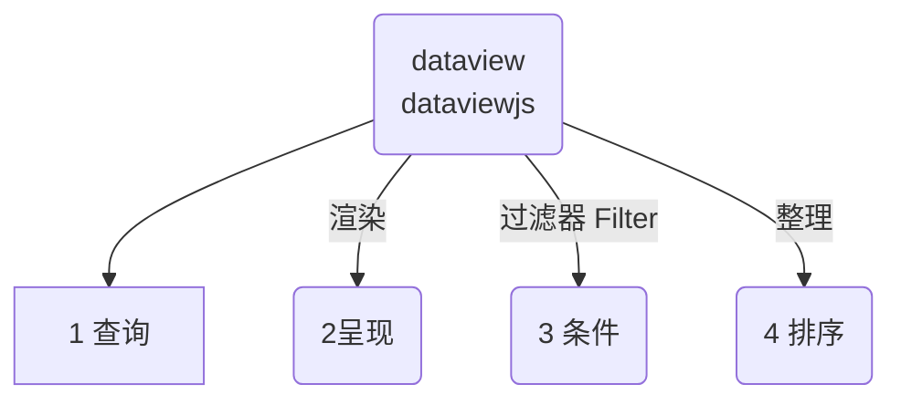

::: info 
Dataviewjs 是 DataviewJavaScript， 能实现自定义查询的语法，适合有 Javascript 基础的人来写。

当你觉得 dataview 已经不够你施展了。就可以使用 javascript 语言在 dataview 写查询。可以定义变量、编写函[[zh/community-plugins/README]]数，并且调用 dataview 的查询方法，但是要符合 dataview 的规范
:::

## 1 dataviewjs 的目标是修改

对于大多数人来说，我们能够知道怎么修改分享的 dataviewjs 代码，然后不报错就够了。如果没有 javascript 基础的话，建议不要过多的去折腾这个。

**比如能修改：**
- 知道 dataviewjs 里面查询From在哪里，格式是什么。怎么改成自己的
- 知道 怎么添加查询的筛选条件。
- 大概知道 dataviewjs 代码实现了什么功能。

::: warning 目标
所以本教程的目标是帮助你对照 dataview 的查询，理解 dataviewjs 的语法。大致的分解一下 dataviewjs 的文档。
:::

## 2 dataviewjs 的逻辑
无论 dataview 也好，dataviewjs 也罢，都必须遵循一个逻辑流程：

::: tip
请时刻记得这4个流程，在下面的认知里就不会跑偏了。无论有多少变量和函数，万变不离其宗，逻辑在这里。
:::

