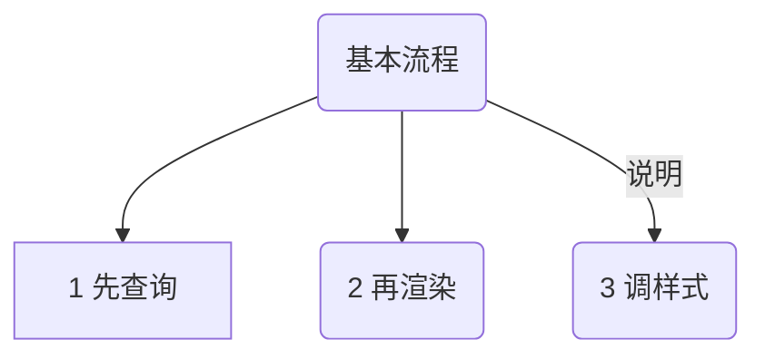
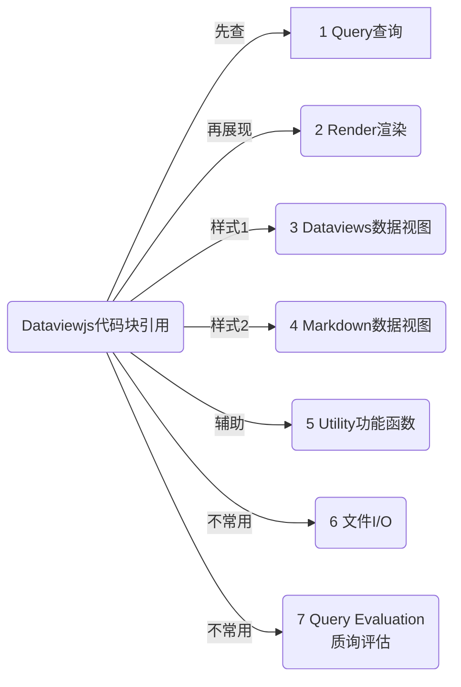
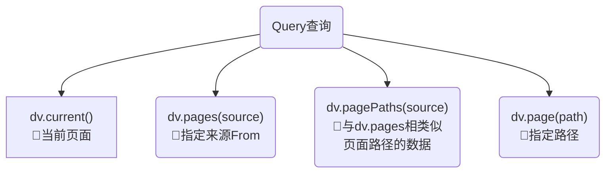
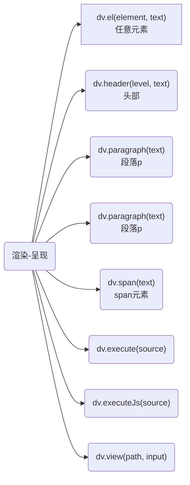

::: tip 更新说明
- 2023-09-11 新增dataviewjs 整体概念理解
:::
## 1 Dataviewjs学习目标
Dataview JavaScript API 允许通过访问 dataview 索引和查询引擎来执行任意 JavaScript。Dataviewjs本质上就是 JavaScript 代码，实际上使用dataview的API接口实现更灵活的查询。 

::: warning 学习的目标是点到即止
Dataviewjs 因为使用了 JavaScript 代码，所以异常的复杂。那么我们也没有必要去学习这种语言。
- 只需要知道简单的规范和语法就可以了。
- 可以根据本文档，速查函数。
- 理解大神们共享的 Dataviewjs 代码，知道改动哪里。
:::

## 2 Dataviewjs 整体概念理解
Dataview JavaScript API为您==提供了JavaScript的全部功能==，并提供了用于提取Dataview数据和执行查询的DSL，允许您创建任意复杂的查询和视图。与查询语言类似，您可以通过 `dataviewjs` 注释的代码块创建Dataview JS块：

::: danger 注意 
Dataview JavaScript API 为您提供了JavaScript的全部功能
:::


## 3 Dataviewjs学习方法
::: tip 对比 dataview 学习 Dataviewjs
为了便于理解，我们对比 dataview 语法，来学习 Dataviewjs。
:::

dataview相对来说简单的多。不熟悉的可以看看 [dataview函数速查表](/zh/dataview/dataview-function.md)

我们可以通过对比 dataview 的方式理解 Dataviewjs 的语法，点到即止就行了。不用过于纠结，毕竟我们是记笔记而不是学程序开发。

## 4 调用Dataviewjs的方法
主要是两种，我们常见的Inline Access 内联访问。也就是代码块包裹的方式引用：

````markdown
```Dataviewjs
dv.pages("#thing")...
```
````

第二种是Plugin Access 插件访问  (可不用看)
您可以通过 app.plugins.plugins.dataview.api ;访问Dataview插件API（从其他插件或控制台）这个API类似于代码块引用，由于缺少隐式文件来执行查询，所以参数略有不同

## 5 代码块引用的语法函数
什么是 Dataviewjs代码块引用呢？就是我们常见的代码块包裹，查询函数写在代码块里面。语法规范如下：
````markdown
```Dataviewjs   
dv.table([], ...)    
```  
````

代码块查询可以通过隐式字段`dv` 或者 `dataview` 变量实现。最终将结果以表格等形式渲染出来。

### 5.1 基本流程就3步


### 5.2 函数分类大纲


## 6 Query查询
`Query查询`只管查出来，不管呈现出来。所以呈现还需要使用`Render渲染`来渲染成HTML元素查看。



### 6.1 dv.current()🍇查询当前页
查询的是，查询语句所在的页面内容。
### 6.2 dv.pages(source)🍈查询指定页
::: tip 查询来源
用dataview的from来理解就可以了，可以是多种对象
:::
```js
dv.pages() //查询库全部文件，类似于 from ""
dv.pages("#books") //查询所有的 #books 标签，类似于 from #books
dv.pages('"folder"') //查询所有的文件夹 "folder"，必须有""双引号
dv.pages("#yes or -#no") //查询标签#yes 或者 不包含#no标签的
dv.pages('"folder" or #tag')//查询文件夹"folder" 或者 标签#tag
```

::: warning 易错点
- pages里面的内容要用单引号包裹`''`
- 文件夹名称要有双引号`"文件夹"`，完整语法应该是'"文件夹"',否则无效
:::

### 6.3 dv.pagePaths(source)🍉查询对象
与 `dv.pages` 相同，但只返回与给定源匹配的页面路径的数据数组
```js
dv.pagePaths("#books") //页面路径中包含#books标签
```
### 6.4 dv.page(path)🍊查询路径
将简单路径或链接映射到完整页面对象，该对象包括所有页面字段。自动进行链接解析，如果不存在，将自动计算出扩展名

```js
dv.page("Index") => 查询文件路径为 /Index 文件夹
dv.page("books/The Raisin.md") => 查询文件路径为 /books/The Raisin.md
```

## 7 渲染-呈现
通过Query查询出来的数据，需要呈现出现，这就是渲染。
::: tip 
你可以理解为 dataview 查询中的 list、table等等。
:::
在 Dataviewjs 里面，你能够更加细致的控制展示的元素。其实都是网页中HTML元素，比如header头部、p段落、span元素等等。
::: details 大纲视图

:::


### 7.1 dv.el(element, text)任意元素
呈现给定html元素中的任意文本。
```js
dv.el("b", "This is some bold text");
```
您可以通过 `cls` 指定要添加到元素的自定义类，通过 `attr` 指定其他属性：
```js
dv.el("b", "This is some text", { cls: "dataview dataview-class", attr: { alt: "Nice!" } });
```
### 7.2 dv.header(level, text)标题
使用给定文本呈现级别为1 - 6的标题。
```js
dv.header(1, "Big!");
dv.header(6, "Tiny");
```
### 7.3 dv.paragraph(text)段落p
渲染段落中的任意文本。
```js
dv.paragraph("This is some text");
```
### 7.4 dv.span(text)span元素
渲染范围内的任意文本（不像段落那样在上方/下方填充）。
```js
dv.span("This is some text");
```
### 7.5 dv.execute(source)🍉执行dataview查询
执行任意数据视图查询并将视图嵌入到当前页面中。
```js
dv.execute("LIST FROM #tag");
dv.execute("TABLE field1, field2 FROM #thing");
```
### 7.6 dv.executeJs(source)🥭执行Dataviewjs查询
执行任意Dataviewjs查询并将视图嵌入到当前页面中。
```js
dv.executeJs("dv.list([1, 2, 3])");
```
### 7.7 dv.view(path, input)
允许自定义视图的复杂功能。将尝试加载给定路径下的JavaScript文件，传递 `dv` 和 `input` 并允许其执行。这使您可以跨多个页面重用自定义视图代码。请注意，这是一个异步函数，因为它涉及到文件I/O-请确保 `await` 结果!
```js
await dv.view("views/custom", { arg1: ..., arg2: ... });
```
如果还想在视图中包含**自定义CSS**，则可以传递一个路径，指向包含 `view.js` 和 `view.css` 的文件夹;CSS将自动添加到视图中：
```js
views/custom
 -> view.js
 -> view.css
```
视图脚本可以访问 `dv` 对象（API对象）和一个 `input` 对象，后者与 `dv.view()` 的第二个参数完全相同。
## 8 Dataviews数据视图
接受普通数组和数据数组
### 8.1 dv.list(elements)列表视图
呈现元素的数据视图列表;接受普通数组和数据数组
```js
dv.list([1, 2, 3]) => list of 1, 2, 3
dv.list(dv.pages().file.name) => list of all file names
dv.list(dv.pages().file.link) => list of all file links
dv.list(dv.pages("#book").where(p => p.rating > 7)) => list of all books with rating greater than 7
```

### 8.2 dv.taskList(tasks, groupByFile)任务列表视图
呈现由 `page.file.tasks` 获取的 `Task` 对象的数据视图列表。只需要第一个参数;如果提供了第二个参数 `groupByFile` （并且为真），则任务将根据它们来自的文件自动分组。
```js
// List all tasks from pages marked '#project'
dv.taskList(dv.pages("#project").file.tasks)

// List all *uncompleted* tasks from pages marked #project
dv.taskList(dv.pages("#project").file.tasks
    .where(t => !t.completed))

// List all tasks tagged with '#tag' from pages marked #project
dv.taskList(dv.pages("#project").file.tasks
    .where(t => t.text.includes("#tag")))
```
### 8.3 dv.table(headers, elements)表格视图
使用给定的标题列表和二维元素数组呈现数据视图表。
```js
// Render a simple table of book info sorted by rating.
dv.table(["File", "Genre", "Time Read", "Rating"], dv.pages("#book")
    .sort(b => b.rating)
    .map(b => [b.file.link, b.genre, b["time-read"], b.rating]))
```
## 9 Markdown Dataviews视图markdown
呈现为普通Markdown字符串的函数，然后您可以根据需要呈现或操作该字符串。
```js
// Render a simple table of book info sorted by rating.
const table = dv.markdownTable(["File", "Genre", "Time Read", "Rating"], dv.pages("#book")
    .sort(b => b.rating)
    .map(b => [b.file.link, b.genre, b["time-read"], b.rating]))

dv.paragraph(table);
```
### 9.1 dv.markdownTable(headers, values)md表格
等效于 `dv.table()` ，它呈现具有给定标题列表和二维元素数组的表，但返回普通Markdown。

### 9.2 dv.markdownList(values)md列表
等效于 `dv.list()` ，它呈现给定元素的列表，但返回纯Markdown。
```js
const markdown = dv.markdownList([1, 2, 3]);
dv.paragraph(markdown);
```

### 9.3 dv.markdownTaskList(tasks)md任务列表
等效于 `dv.taskList()` ，它呈现任务列表，但返回纯Markdown。
```js
const markdown = dv.markdownTaskList(dv.pages("#project").file.tasks);
dv.paragraph(markdown);
```
## 10 Utility功能
### 10.1 dv.array(value)
将给定值或数组转换为数据视图数据数组。如果该值已经是数据数组，则返回未更改的值。
```js
dv.array([1, 2, 3]) => dataview data array [1, 2, 3]
```
### 10.2 dv.isArray(value)
如果给定值是数组或数据视图数组，则返回true。
```js
dv.isArray(dv.array([1, 2, 3])) => true
dv.isArray([1, 2, 3]) => true
dv.isArray({ x: 1 }) => false
```
### 10.3 dv.fileLink(path, [embed?], [display-name])
将文本路径转换为数据视图 Link 对象;你也可以选择指定链接是否嵌入以及它的显示名称。
```js
dv.fileLink("2021-08-08") => link to file named "2021-08-08"
dv.fileLink("book/The Raisin", true) => embed link to "The Raisin"
dv.fileLink("Test", false, "Test File") => link to file "Test" with display name "Test File"
```
### 10.4 dv.sectionLink(path, section, [embed?], [display?])
将文本路径+节名称转换为数据视图 `Link` 对象;你也可以选择指定链接是否被嵌入以及它的显示名称.
```js
dv.sectionLink("Index", "Books") => [[Index#Books]]
dv.sectionLink("Index", "Books", false, "My Books") => [[Index#Books|My Books]]
```
### 10.5 dv.blockLink(path, blockId, [embed?], [display?])
将文本路径+块ID转换为数据视图 `Link` 对象;你也可以选择指定链接是否被嵌入以及它的显示名称.
```js
dv.blockLink("Notes", "12gdhjg3") => [[Index#^12gdhjg3]]
```
### 10.6 dv.date(text)
强制文本和链接到luxon `DateTime` ;如果提供了 `DateTime` ，则原样返回。
```js
dv.date("2021-08-08") => DateTime for August 8th, 2021
dv.date(dv.fileLink("2021-08-07")) => dateTime for August 8th, 2021
```
### 10.7 dv.duration(text)
强制文本为luxon Duration ;使用与数据视图持续时间类型相同的解析规则。
```js
dv.duration("8 minutes") => Duration { 8 minutes }
dv.duration("9 hours, 2 minutes, 3 seconds") => Duration { 9 hours, 2 minutes, 3 seconds }
```
### 10.8 dv.compare(a, b)
根据dataview的默认比较规则比较任意两个JavaScript值;如果您正在编写自定义比较器并希望回退到默认行为，则此选项非常有用。如果为 `a < b` ，则返回负值;如果为 `a = b` ，则返回0;如果为 `a > b` ，则返回正值。
```js
dv.compare(1, 2) = -1
dv.compare("yes", "no") = 1
dv.compare({ what: 0 }, { what: 0 }) = 0
```
### 10.9 dv.equal(a, b)
比较两个任意JavaScript值，如果根据Dataview的默认比较规则相等，则返回true。
```js
dv.equal(1, 2) = false
dv.equal(1, 1) = true
```
### 10.10 dv.clone(value)
深度克隆任何数据视图值，包括日期、数组和链接。
```js
dv.clone(1) = 1
dv.clone({ a: 1 }) = { a: 1 }
```
### 10.11 dv.parse(value)
## 11 File I/O
### 11.1 ⌛ dv.io.csv(path, [origin-file])
从给定路径（链接或字符串）加载CSV。相对路径将相对于可选的原始文件进行解析（如果未提供，则默认为当前文件）。

返回一个数据视图数组，每个元素包含一个对象的CSV值;如果文件不存在，则返回 `undefined` 。
```js
await dv.io.csv("hello.csv") => [{ column1: ..., column2: ...}, ...]

```
### 11.2 ⌛ dv.io.load(path, [origin-file])
异步加载给定路径（链接或字符串）的内容。相对路径将相对于可选的原始文件进行解析（如果未提供，则默认为当前文件）。返回文件的字符串内容，如果文件不存在，则返回 `undefined` 。

```js
await dv.io.load("File") => "# File\nThis is an example file..."
```
### 11.3 dv.io.normalize(path, [origin-file])
将相对链接或路径转换为绝对路径。如果提供了 `origin-file` ，则解析过程就像解析来自该文件的链接一样;如果不是，则相对于当前文件解析路径。
```js
dv.io.normalize("Test") => "dataview/test/Test.md", if inside "dataview/test"
dv.io.normalize("Test", "dataview/test2/Index.md") => "dataview/test2/Test.md", irrespective of the current file
```
## 12 Query Evaluation
### 12.1 ⌛ dv.query(source, [file, settings])
执行数据视图查询并将结果作为结构化返回返回。此函数的返回类型因执行的查询类型而异，但始终是一个带有 `type` 的对象，表示返回类型。这个版本的 `query` 返回一个结果类型--您可能需要 `tryQuery` ，它会在查询执行失败时抛出一个错误。
```js
await dv.query("LIST FROM #tag") =>
    Success { type: "list", values: [value1, value2, ...] }

await dv.query(`TABLE WITHOUT ID file.name, value FROM "path"`) =>
    Success { type: "table", headers: ["file.name", "value"], values: [["A", 1], ["B", 2]] }

await dv.query("TASK WHERE due") =>
    Success { type: "task", values: [task1, task2, ...]}

```
`dv.query` 接受两个附加的可选参数：1. `file` ：解析查询的文件路径（如果引用 `this` ）。默认为当前文件。2. `settings` ：运行查询的执行设置。这在很大程度上是一个高级用例（我建议您直接检查API实现以查看所有可用选项）。

### 12.2 ⌛ dv.tryQuery(source, [file, settings])
与 `dv.query` 完全相同，但在短脚本中更方便，因为执行失败将作为JavaScript异常而不是结果类型引发。
```js
⌛ dv.queryMarkdown(source, [file], [settings]) 第0号

```
### 12.3 ⌛ dv.queryMarkdown(source, [file], [settings])
等效于 `dv.query()` ，但返回渲染的Markdown。
```
await dv.queryMarkdown("LIST FROM #tag") =>
    Success { "- [[Page 1]]\n- [[Page 2]]" }
```
### 12.4 ⌛ dv.tryQueryMarkdown(source, [file], [settings])
与 `dv.queryMarkdown()` 完全相同，但在解析失败时抛出错误。
```js
dv.tryEvaluate(expression, [context])
```
### 12.5 dv.tryEvaluate(expression, [context])
计算任意数据视图表达式（如 `2 + 2` 或 `link("text")` 或 `x * 9` ）;在分析或计算失败时抛出 `Error` 。 `this` 是始终可用的隐式变量，它引用当前文件。
```js
dv.tryEvaluate("2 + 2") => 4
dv.tryEvaluate("x + 2", {x: 3}) => 5
dv.tryEvaluate("length(this.file.tasks)") => number of tasks in the current file
```
### 12.6 dv.evaluate(expression, [context])
计算任意数据视图表达式（如 `2 + 2` 、 `link("text")` 或 `x * 9` ），返回结果的 `Result` 对象。您可以通过选中 `result.successful` （然后获取 `result.value` 或 `result.error` ）来展开结果类型。如果您想要一个在求值失败时抛出错误的更简单的API，请使用 `dv.tryEvaluate` 。
```js
dv.evaluate("2 + 2") => Successful { value: 4 }
dv.evaluate("2 +") => Failure { error: "Failed to parse ... " }
```


## 13 常用的js语法
::: warning 不用把自己折腾成程序员
这里讲解的是简单的js语法，不涉及太过于复杂的，实际上也不用去理解这些。
:::
### 13.1 示例语法1：变量和Dataviewjs函数调用
我们以实际的一段常用代码做解释：
#### 13.1.1 代码示例：
::: code-tabs
@tab 原始dataviesjs
````markdown
```Dataviewjs
let ftMd = dv.pages("").file.sort(t => t.cday)[0]
let total = parseInt([new Date() - ftMd.ctime] / (60*60*24*1000))
let totalDays = "您已使用 *Obsidian* "+total+" 天，"
let nofold = '!"misc/templates"'
let allFile = dv.pages(nofold).file
let totalMd = "共创建 "+
	allFile.length+" 篇笔记"
let totalTag = allFile.etags.distinct().length+" 个标签"
let totalTask = allFile.tasks.length+"个待办。 "
dv.paragraph(
	totalDays+totalMd+"、"+totalTag+"、"+totalTask
)
```
````
@tab:active dataviesjs着色后
```js
let ftMd = dv.pages("").file.sort(t => t.cday)[0]
let total = parseInt([new Date() - ftMd.ctime] / (60*60*24*1000))
let totalDays = "您已使用 *Obsidian* "+total+" 天，"
let nofold = '!"misc/templates"'
let allFile = dv.pages(nofold).file
let totalMd = "共创建 "+
	allFile.length+" 篇笔记"
let totalTag = allFile.etags.distinct().length+" 个标签"
let totalTask = allFile.tasks.length+"个待办。 "
dv.paragraph(
	totalDays+totalMd+"、"+totalTag+"、"+totalTask
)
```
@tab 注释过的
```js
// 注释BY咖啡豆文档 httpss://obsidian.vip 
// 该段代码用于计算使用 Obsidian 的总天数以及创建的笔记数、标签数、待办事项数，并将这些信息输出为一个段落

let ftMd = dv.pages("").file.sort(t => t.cday)[0]; // 找到最早创建的笔记，并将其记录在 ftMd 变量中
let total = parseInt([new Date() - ftMd.ctime] / (60*60*24*1000)); // 计算自创建第一篇笔记以来的总天数
let totalDays = "您已使用 *Obsidian* "+total+" 天，"; // 将使用 Obsidian 的总天数作为字符串记录在 totalDays 变量中
let nofold = '!"misc/templates"'; // 用于过滤文件夹，只保留没有被归类的笔记
let allFile = dv.pages(nofold).file; // 获取所有未被归类的笔记，并将其记录在 allFile 变量中
let totalMd = "共创建 "+allFile.length+" 篇笔记"; // 计算笔记总数并将其作为字符串记录在 totalMd 变量中
let totalTag = allFile.etags.distinct().length+" 个标签"; // 计算标签总数并将其作为字符串记录在 totalTag 变量中
let totalTask = allFile.tasks.length+"个待办。 "; // 计算待办事项总数并将其作为字符串记录在 totalTask 变量中
dv.paragraph(
	totalDays+totalMd+"、"+totalTag+"、"+totalTask // 将上述信息组合成一个段落，并将其输出
);

```
:::

这段代码会显示类似这样的信息
::: tip 显示结果
您已使用 _Obsidian_ 114 天，共创建 91 篇笔记、37 个标签、66个待办。
:::

#### 13.1.2 代码解读
::: tip 
这里不需要理解所有的内容，只需要关注几个重点：
:::

::: code-tabs#标签id要改不要重复(联动的上下一致)
@tab let#jsid1
```js
let  //let 用来定于变量使用，方便写入数据，下面调用

let allFile = dv.pages(nofold).file; 
// 格式如此，定一了一个变量 allFile ，
// 他的值是 = 等号后面的内容，
// 用英文的";"分号结束
```
@tab dv.paragraph#jsid2
````js
dv.paragraph()  
// 用这个关建字，dv.paragraph 搜索本文档，
// 在6渣染-呈现 6.3 dv.paragraph(text)段落p 可看到函数。
// 意思就是将结果渲染呈现为 段落。


dv.paragraph(
	totalDays+totalMd+"、"+totalTag+"、"+totalTask
)
// 上面是将 let 定义的几个变量 全部拼接 在一起，形成新的内容。
//其中用 + 号连接，
//其中用 "内容"，表示是字符串，将"、"顿号也连接了过来。
````
@tab 面板3#jsid3
````js
dv.paragraph  //
````
@tab 面板4#jsid4
````markdown
cd tab4
````
@tab 面板5#jsid5
````markdown
cd tab4
````
:::

::: code-tabs#标签id要改不要重复(联动的上下一致)
@tab 面板1#jsid1
````markdown
【这里可】
`let` 是一个 ES6 中的关键字，用于声明块级作用域变量。

在 JavaScript 早期版本中，变量只能使用 `var` 关键字声明，
而 `var` 声明的变量是函数作用域或全局作用域的，
这意味着在函数中声明的变量在函数外部也可以被访问到，
而且存在变量提升的问题。

`let` 声明的变量则只在块级作用域中有效，
块级作用域是指 `{}` 中的代码块，例如 `for` 循环、`if` 语句等。`let` 声明的变量只在声明它的代码块中有效，
不会像 `var` 变量一样污染整个作用域。

`let` 的使用方法与 `var` 类似，但是需要注意以下几点：

1.  声明变量时需要使用 `let` 关键字；
2.  变量只在当前作用域中有效，不会被提升；
3.  变量可以在声明之后修改其值。

````
@tab 面板2#jsid2
````markdown
渲染段落中的任意文本。
dv.paragraph("This is some text");

同理，我们可以在本文档中，找到对应的函数，进行调用
````
@tab 面板3#jsid3
````markdown
cd tab3
````
@tab 面板4#jsid4
````markdown
cd tab4
````
@tab 面板5#jsid5
````markdown
cd tab5
````
:::

::: tip 小结
这里只需要了解 `let` 是定义了变量，方便后面使用。他的格式是：
1. 注意`let`是固定用法，中间的空格要保留，等号前后都加个空格，也是为了规范和出现莫名的错误。照这个格式抄就行了。
2. 一行的结束符是";"==英文的==分号
3. 注意在代码里，使用的符号，都是英文的（除非是字符串内部）

```js
let 变量名 = 数据;

// 示例
let varname = "我是数据";
```
:::


