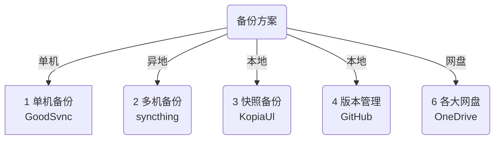

---
# 这是文章的标题
title: 备份方案
# 这是页面的图标
icon: page
# 这是侧边栏的顺序
order: 3
---
## 备份的必要性
obsidian作为一个本地优先的软件，带来了便利，也带来了风险。当本地环境出现问题，会发生丢失文件，或者文件损坏的情况。当然也存在小概率硬件灭失的风险。

数据是无价的，而作为笔记/日记存在的obsidian文件更加的珍贵。我们需要使用比较稳妥的方法做好文件的备份。

## 备份方案

不要被这些名词吓唬住了，其实就是些简单的软件。按要求配置好就可以了，下面手把手介绍一下使用方法。

::: danger 自定义标题
危险容器
:::