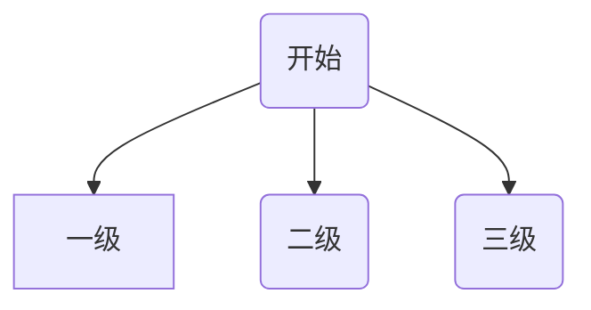
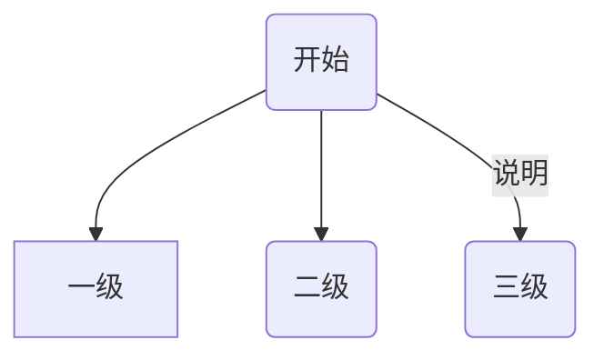
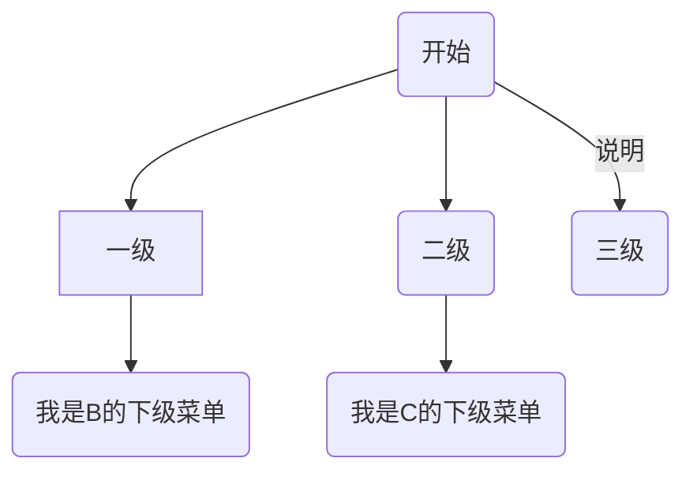
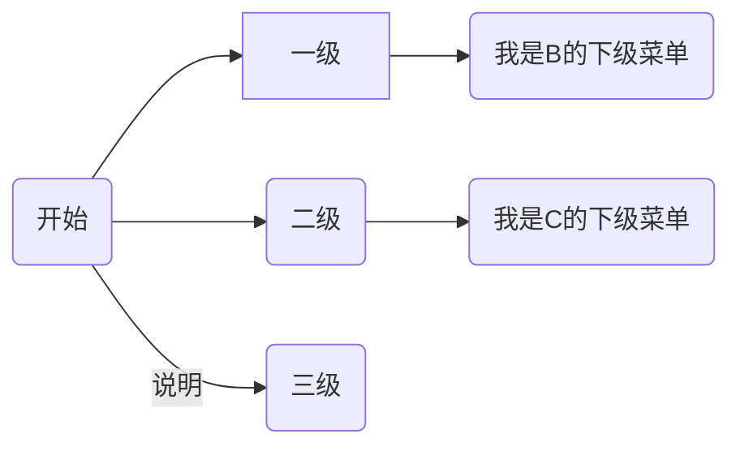

---
# 这是文章的标题
title: mermaid流程图
# 这是侧边栏的顺序
order: 15
# 这是页面的图标
icon: page
# 控制左侧显示层数(只显示2层)，但是右侧会显示3级
headerDepth: 2
---
**插件简介：**  
mermaid，是markdown自带的**流程图语法**，obsidian中也支持了部分mermaid的特性。我们不用了解太多，照着下面的用就可以了。

**代码：**  
::: code-tabs
@tab 流程图语法
````markdown

````

@tab 带说明的流程图
````markdown

````
@tab 带子菜单的流程图
````markdown

````
@tab 调整方向
````markdown

````
:::

**流程图演示1：**


**流程图演示1：**  

**流程图演示3：**  


**流程图演示4：**  


