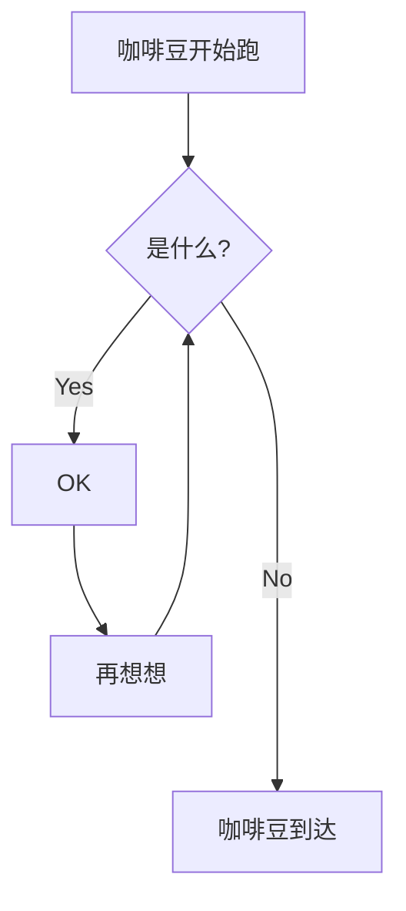

::: tip 更新说明
- 2023-10-16 ✨优化 流程图基础语法-如何调整方向
- 2023-10-16 ✨新增 流程图高级用法-序列图
- 2023-10-16 ✨新增 流程图高级用法-甘特图
- 2023-10-16 ✨新增 流程图高级用法-类图class
- 2023-10-16 ✨新增 流程图高级用法-ER图
- 2023-10-16 ✨新增 流程图高级用法-mindmap导图
- 2023-10-16 ✨新增 流程图高级用法-四象限图-SWOT分析

:::

## mermaid流程图基础语法
**插件简介：**  
mermaid，是markdown自带的**流程图语法**，obsidian中也支持了部分mermaid的特性。我们不用了解太多，照着下面的用就可以了。

**代码：**  
::: code-tabs
@tab 流程图语法
````markdown

````

@tab 带说明的流程图
````markdown

````
@tab 带子菜单的流程图
````markdown

````
@tab 调整方向
````markdown

````
:::

**流程图演示1：**


**带说明的流程图：**  

**带子菜单的流程图：**  


**调整方向：**  
- TB：top/bottom顶部到底部
- LR：Left/Right 从左到右
- BT: bottom/top 底部到顶部
- RL: Right/Left 从右到左


**更灵活的流程图**




## mermaid流程图高级用法

### 1 序列图/Sequence


::: code-tabs
@tab 时序图代码
````lua

````
:::

### 2 甘特图/Gantt


::: code-tabs
@tab 甘特图代码
````lua

````
:::

### 3 class类图


::: code-tabs
@tab class类图代码
````lua

````

:::

### 4 ER图


::: code-tabs
@tab ER图代码
````lua

````
:::
### 5 mindmap导图
 . 

::: code-tabs
@tab mindmap代码
````lua

````
:::


### 6 百分比饼图 pin

::: code-tabs
@tab mindmap代码
````lua

````
:::

### 7 四象限图


::: code-tabs
@tab mindmap代码
````lua
```mermaid
quadrantChart
    title 一个研究咖啡豆子的SWOT图表📊
    
    x-axis "有帮助🔥" --> "有害的☠️"
    y-axis "外部来源/环境属性" --> "内部来源/组织属性"
    
    quadrant-1 "【Weaknesses/劣势☠️】"
    quadrant-2 "【Strengths/优势🔥】"
    quadrant-3 "【Opportunities/机会🔥】"
    quadrant-4 "【Threats/威胁☠️】"
    
    "咖啡豆文档站": [0.3, 0.7]
    "咖啡豆公众号": [0.2, 0.8]
    "咖啡豆微信群": [0.35, 0.9]
    "咖啡豆微信群": [0.25, 0.6]
    
    "网站要花钱": [0.3, 0.23]
    "写作要花时间": [0.30, 0.34]
    
    "电脑罢工崩溃": [0.7, 0.79]
    
    "心情不好不想写了": [0.78, 0.34]
```
````
:::

对于上面的 散点信息， 前面是标签后面是坐标。坐标的依据是这样的：

```lua
"咖啡豆文档站": [0.3, 0.7]

# [X,Y]
```


- 1-5是一个区间，6-10是另一个区间，按照横，纵的区间定位。
- X 横的，0.1~0.5 在左1范围，0.6~1.0范围在右边
- Y 竖的，0.1~1.0,其中0.1最底下。


### 8 时间轴

**简略版时间轴**

```mermaid
timeline
    title 咖啡豆社群发展史
    2023-02-03 : 咖啡豆文档站上线
    2023-03-03 : 咖啡豆社群组建
    2023-03-04 : 蹦跶的咖啡豆公众号发布
    2023-09-03 : www.obsidian.vip上线
```

::: code-tabs
@tab 面板1
````markdown
```mermaid
timeline
    title 咖啡豆社群发展史
    2023-02-03 : 咖啡豆文档站上线
    2023-03-03 : 咖啡豆社群组建
    2023-03-04 : 蹦跶的咖啡豆公众号发布
    2023-09-03 : www.obsidian.vip上线
```
````
:::


**时间轴带详情描述**

```mermaid
timeline
        title 咖啡豆的第二种时间轴-带详细分类的
        section 咖啡豆文档站
          第一时间点 : 写着好玩没啥事，闲得慌
          第二时间点 : 认真写文，持续更新
        section 咖啡豆公众号
          第一 阶段 : 源于突然的想法开始写作.
                  : 为了部分不能及时. 追新的同学们更新. 很有意思的内容
          第二 阶段 : 内容和网站有所区分.
                  : 会包括不能长期更新内容. 文字中间的换行. 主要看看怎换行了.
```

::: code-tabs
@tab 面板1
````markdown
```mermaid
timeline
        title 咖啡豆的第二种时间轴-带详细分类的
        section 咖啡豆文档站
          第一时间点 : 写着好玩没啥事，闲得慌
          第二时间点 : 认真写文，持续更新
        section 咖啡豆公众号
          第一 阶段 : 源于突然的想法开始写作.
                  : 为了部分不能及时. 追新的同学们更新. 很有意思的内容
          第二 阶段 : 内容和网站有所区分.
                  : 会包括不能长期更新内容. 文字中间的换行. 主要看看怎换行了.
```
````
:::

### 9 git

```mermaid
gitGraph
       commit
       commit
       branch develop
       commit
       commit
       commit
       checkout main
       commit
       commit
```

::: code-tabs
@tab 面板1
````markdown
```mermaid
gitGraph
       commit
       commit
       branch develop
       commit
       commit
       commit
       checkout main
       commit
       commit
```
````
:::

### 10 state 图

```mermaid
stateDiagram-v2
    [*] --> 我是咖啡豆
    我是咖啡豆 --> [*]
    我是咖啡豆 --> 打成咖啡粉
    打成咖啡粉 --> 我是咖啡豆
    打成咖啡粉 --> 泡成咖啡
    泡成咖啡 --> [*]
```


::: code-tabs
@tab 面板1
````markdown
```mermaid
stateDiagram-v2
    [*] --> 我是咖啡豆
    我是咖啡豆 --> [*]
    我是咖啡豆 --> 打成咖啡粉
    打成咖啡粉 --> 我是咖啡豆
    打成咖啡粉 --> 泡成咖啡
    泡成咖啡 --> [*]
```
````
:::


这里的语法，注意模仿上面的代码修改，不需要过多的理解语法。
- `stateDiagram-v2`是申明语法类型
- `[*]`是起始点
- `-->`是箭头
- 然后按照每个名称进行对接，注意下就可以了。

::: danger 加群交流
如果在使用和学习中有不明白的地方，或者想看看别人的经验
- 可以查看[进阶用法](/zh/advanced)
- 可以加群和大家聊聊，加微信 `coffeebean1688` 蹦跶的咖啡豆，然后进群
- 可以查看[咖啡豆豆龙_哔哩哔哩](https://space.bilibili.com/618777356)) 视频教程。😜**关注、👍点赞、📀投币一键三连**
- 关注公众号(文章很多)：`蹦跶的咖啡豆
- 示例库（筹备中）
- 网站启用新域名：https://obsidian.vip 给VIP的你，很好记
:::
::: tip 🌱【点我-扫码加群】
 
::: 
::: tip 🍻【微信扫码-打赏】

:::


