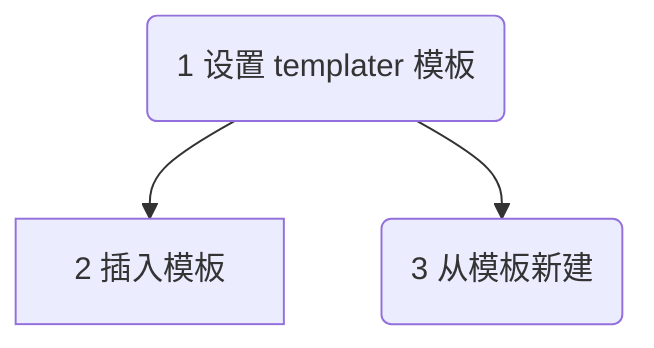
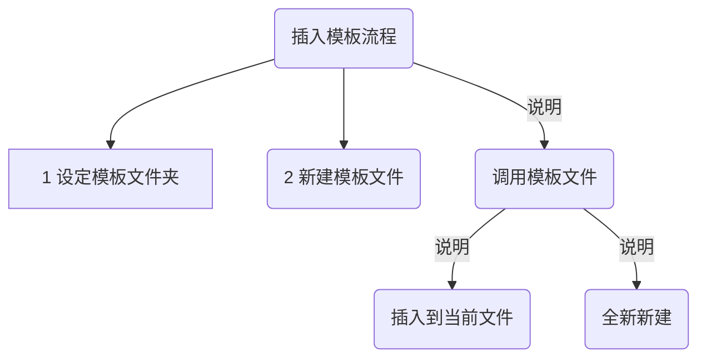

## 1 Obsidian templater 插件简介

Obsidian templater 插件是可以替代Obsidian核心模板插件，拥有更强的模板功能和语法。推荐使用这个插件，替换系统默认插件。

Templater是一种模板语言，允许您在笔记中插入变量和函数结果。它还允许您执行JavaScript代码来操作这些变量和函数。

::: tip 
用通俗的语言来描述，就是Obsidian templater 可以使用模板和变量去生成一些固定的笔记，提高你的写作速度和规范格式。
:::

**插件安装：**
::: tip 插件安装
打开 obsidian → 设置 ⚙️ → 第三方插件 → 社区插件市场，搜索关键字安装

注意：你需要关闭第三方插件的**安全模式**，才能安装社区插件，建议关闭。
:::


:::  danger Obsidian插件国内高速下载
有些同学无法正常访问Obsidian第三方市场，那么可以使用 ==obsidian.vip== 网站提供的插件。
- 不限速，不限次数下载
- 所有插件，包括未上架的插件。
- 会实时更新插件

**下载地址：**

- obsidian**插件下载** | obsidian文档咖啡豆版  
https://obsidian.vip/zh/documentation/obsidian-plugins-download.html

- obsidian**程序下载**(所有平台所有历史版本) | obsidian文档咖啡豆版  
https://obsidian.vip/zh/documentation/obsidian-download.html

- obsidian**主题下载**(所有主题) | obsidian文档咖啡豆版  
https://obsidian.vip/zh/documentation/obsidian-themes-download.html
:::

## 2 templater基础语法
::: warning 不要用的过于复杂
- 建议不要使用的过于复杂，就用基础的模板生成功能。
- 其实简单的用法也可以有很多的玩法
:::

**调用templater模板的流程**



**通常的调用语法格式**

- 注意一定是固定的格式，`<%`和 `%>` 开头和结尾的。
- 注意templater的调用，使用 `tp.` 开头。

```js
<% tp.date.now("YYYY-MM-DD") %>
```


::: tip 技巧1:自动补全函数
安装templater插件之后，按格式输入后 `tp.` 会自动补全函数，并且有函数说明。

 
:::

## 3 插入模板的一般流程

1. **设定模板文件夹**：强烈建议先设定一个 **templater** 文件夹📁，把所有的模板都放在这里，方便管理和调用。
2. **新建模板文件**：在模板文件夹中，新建一个模板笔记，注意尽量不要使用中文文件名称，避免出错。
3. **调用模板文件**：在需要的地方调用模板文件，有两种方式
	1. 插入到当前文件中：通过命令面板调用 templater 的命令，选择模板。
	2. 全新新建：通过命令去调用  templater ，全新的一个文件。



