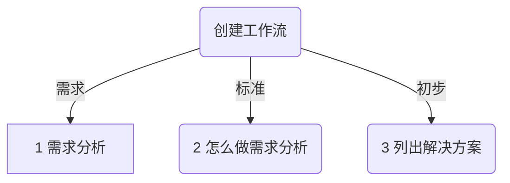
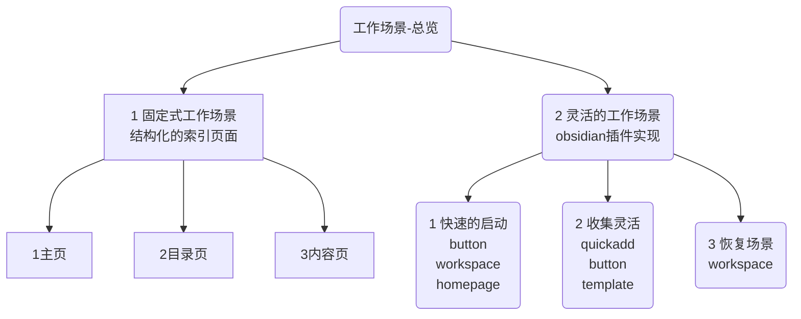
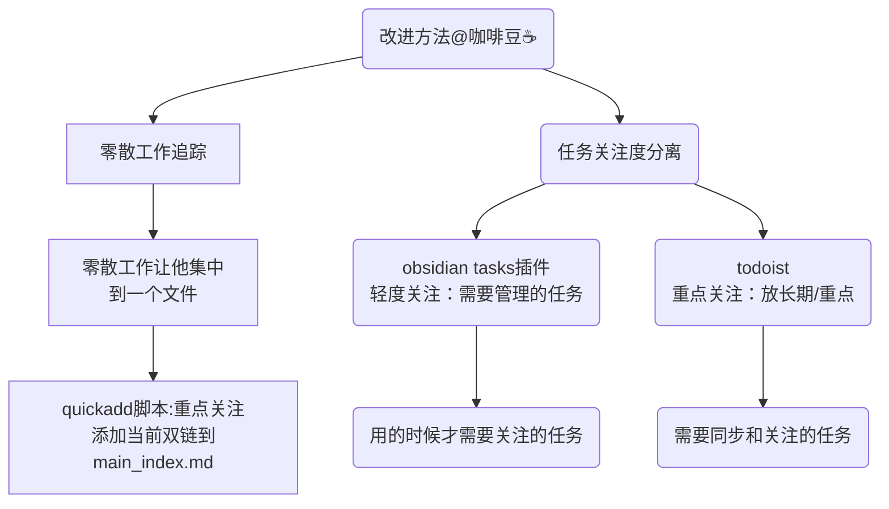

---
# 这是文章的标题
title: 工作流初探
# 这是侧边栏的顺序
order: 1
# 这是页面的图标
icon: page
---
w::: info 被催更了📢
本来工作流这部分工作，准备放在后面写的。不过被朋友们催更了，所以先写一部分。当然随着认知的深入，这部分也许会重构更新🎉。
:::

::: danger 加群交流
如果在使用和学习中有不明白的地方，或者想看看别人的经验
- 可以查看[进阶用法](/zh/advanced)
- 可以加群和大家聊聊，加微信 `coffeebean1688` 蹦跶的咖啡豆，然后进群
- 可以查看[咖啡豆豆龙_哔哩哔哩](https://space.bilibili.com/618777356)) 视频教程。😜**关注、👍点赞、📀投币一键三连**
- 关注公众号(文章很多)：`蹦跶的咖啡豆
- 示例库（筹备中）
- 网站启用新域名：https://obsidian.vip 给VIP的你，很好记
:::

## 1.什么是工作流
工作流是一个宽泛的概念，来个官方一点的描述。

::: info 官方定义
工作流（工作流程）是完成特定过程所必需的一系列相关步骤或逻辑，通常被称为业务流程。
:::
**工作流的意义：**
- 减少重复繁琐的工作，避免经常跌进同一条河里🌧️！
- 减少事后整理的过程，避免创建随手扔，整理一顿找，天天重复找😅！
- 减少忙中出错的可能性，避免甲文件放在乙文件中，最后找不到了🔎
- 减少工作中不必要的步骤，避免总是加进奇怪的东西👹。
- 能够快速找到需要的内容📙。

### obsidian中的工作流
::: tip 1.快存快取的流程
obsidian 作为第二大脑，是一个私人知识库，理想的流程如下：
- **能够快速存储你的知识笔记**，并按照一定的逻辑分类，事后不用整理。
- **能快速找到你需要的东西**，这是obsidian存在的意义，光存储不能读取，又是一个内容垃圾场？
:::

既然是工作流，肯定不能完全脱离工作，这样我们继续优化工作流的概念。

::: danger 2.融合实际工作的流程
obsidian 除了知识笔记外，还可以存储工作或生活的流程。  
他作为第二大脑，能解决一些现实问题。

- 协助解决工作中重复的问题。
- 协助存储工作中零碎的信息。
- 简化工作中繁复的流程。

**比如：**
- **零星的灵感存放和回顾**，当你对某个工作和事务有新想法，不跳出的马上存储。
- **我写的文章事后总是找不到**，忘记在哪里叫什么名字，好一顿搜索也找不全。
- **经常重复做的事**，简单的事情重复做，小细节中浪费时间，总体效率低下。
:::

::: warning
当然，如何能帮你解决实际问题。
需要看你自己需要什么东西？我们可以一步步的向下分解，看如何去做分析。
:::

## 2.怎么创建工作流




### 1/3 需求分析
- 你的身份是什么？你在工作中需要解决哪方面的问题？
- 你的需求是什么？在知识管理这一块
- 你的工作中有什么重复的，可以依靠笔记软件解决的？

::: info 需求举例：通用身份
1. 我需要**快速找到**资料
2. 我需要**快速记录**灵感收藏，**事后能够找到**
3. 我需要记录思考的过程，事后能够找到
4. 我需要协助处理手头事情，**流程化记录**和事后查找
5. 我需要记录任务或灵感的场景，能够快速返回**工作场景**
:::

### 2/3 需求的标准：遇到的问题
需求分析，在各行各业中都是一个很宽泛的东西。那么我们怎么去分析自己在 **知识管理** 上的需求呢？

::: warning
注意：这里指的是 **知识管理** ，而不是obsidian使用。我们要找到自己正常的需求，而不是使用软件的需求。可能别的软件也可以解决需求。
::: 
**怎么查找自己的需求呢？**  
这里提供了一些给你分析需求的标准，供你参考。

::: danger 遇到的问题就是需求
- 我记录的知识，然后回头还要使劲翻找，十分不容易找到的东西。
- 我想记录东西，还要思考分类到哪里，存在哪里合适。
- 我要记录的东西，还得每次复制一个固定的模板，每次都要去找这个模板。还容易找不到的。
- 总体就是会卡壳的步骤。
:::

列出自己遇到的问题了，然后在去归纳一下，就可以得到自己真实的需求。不熟悉这个操作没关系。**先尝试做第一次，然后在去不断的优化就可以了。** 这个不单单是在 obsidian 中使用，在别的事情上同样适用。这是一种需求分析的方法，简单易操作。
::: tip
投诉和不满也是需求的一种，对你自己来说，就是遇到的问题，和做事的不顺畅。相对应的，下文所提优秀的工作流，衡量的标准是**舒适度舒服**。
:::


### 3/3 列出可能的解决方案
针对遇到的问题，抽出实际的需求。下面尝试对需求提出解决方案：
>- 这一块我本地记录的比较多，但不好把文章拉的过长，简单描述下。
>- 如果理解上有问题，可以交流或者提建议。

**针对 1/3 需求问题，主要需求就是：**
- **快速找到**资料
- **快速记录**灵感收藏，**事后能够找到**
- 快速返回**工作场景**

::: tip 首次方案举例
- 快速找到、快速记录、事后找到、工作场景。都是围绕一个工作场景来展开。
- 在场景下完成特定的任务，就不容易搞错，也能快速的录入和查找。
:::

::: details 工作场景是什么
**工作场景是什么？**
我们不管做任何事情，都有一个工作场景。能够无缝恢复工作场景就会提高工作效率。比如厨师做菜每次都需要一个案板，一把菜刀，一口锅，进厨房就可以开始干活。如果去了还要找菜刀和锅就会浪费时间，这个就是工作场景。
:::

::: details 另一个工作场景举例
**另一个工作场景举例**
- MacBook 在使用的时候打开一堆网页，一堆文档。有事我要马上走，合上电脑就跑。
- 过了3小时之后我重新开始，可能我都不知道刚才打开的是什么东西，思维就断了。
- 但是MacBook很不错，打开电脑刚刚运行过的一切东西全都在，瞬间重返刚刚的工作场景，一下子恢复了中断后的思路。这就是工作场景的无缝接续。
:::




**1、 结构化的工作场景：用 index(索引页)🌻 做工作场景：**   
这部分内容就是提前固化一部分内容，将分类提前做好，然后从分类去新建文件。就满足了保留一个工作场景的要求，然后事后也好查找。**从固定的位置，进入固定的工作场景💡**。

**说完概念，这部分简单的话来说：**  
- a. 就是提前做好主页，链接到栏目页，然后栏目页下面链接到具体的文章。  
- b. 我们写文章，就从栏目页开始，`[[文件名]]` 这样写。这样的好处就是，文章从**开始写就已经归类**，**不用事后在整理**。你**要找也只要在这**里找就够了  
- b. 提示：可以直接从分类页打开新建或者查找，不用从主页开始点击。  
::: tip
每个人的工作场景都是有限的，在某个时间段，某个身份下，都是类似的，可以提前规划好。比如，学习、电脑技巧、写作、日记之类。
:::
::: note
index(索引页) 方式，也叫做MOC(Maps of Content)。但我更愿意称之为索引页，说白了其实就是个网站，有主页，栏目页，内容页。每个页面有一个index索引页，更好理解，这里就不展开讲了。
:::

**2、进阶式的工作场景：用obsidian插件🏆恢复工作场景**  
单一的工作场景，并不能覆盖所有的情况。有些工作或者学习是突发且不能提前被分类的。所以我们的工作场景就要有一定的**容错能力和学习能力**。

**a.需要具备的特性**
**面对的需求：**
1. **快速**的**收集**，按**固定格式**收集在一处。
2. 事后不要过多整理。
3. 随时可中断，事后可接续。
4. 极度适合个人需求定制。

**b.可能的场景：**
1. TODO 任务收集
2. 灵感碎片收集
3. 资源收集
4. 日记记录
5. emos 写作

**c.obsidian 技术栈：**  
 1. **快速**的启动，[button](/zh/community-plugins/button.md)、[workspace](/zh/community-plugins/Workspaces-Plus.md)、homepage
 2. **收集**灵活，[quickadd](/zh/community-plugins/quickadd.md) 捕获，
 3. **固定**的格式，[template](/zh/community-plugins/templater.md)，
 4. **恢复**场景，[workspace](/zh/community-plugins/Workspaces-Plus.md)，[button](/zh/community-plugins/button.md)  
 5. **自动整理**，[dataview](/zh/community-plugins/dataview.md) 查询、Auto Note Mover 文件自动移动

## 3.不断优化工作流⭐️
::: warning 不断优化工作流：关键点
**评判的标准：**
1. 自己的工作学习，是不是有一种流畅感，越用越舒服就对了。
2. 落实在obsidian上，存东西是不是顺畅，**找东西是不是飞快**？
:::

建议单独建立一个文件`工作流设计记录.md`，然后将自己的需求、解决方案都放进去。运行一段时间之后，再记录新的问题和改进方案。不断优化和调整，直至满足自身的需求。

### 优化模板案例1：

```markdown
## 改进方案 2023-02-01
### 面临问题
1.零散的工作和灵感，依然很难收集和回到工作场景。
2.任务管理还是有混乱的地方，收集多过整理，抓不到重点任务。也无法追踪一些长期的任务。
### 改进尝试
**1、零散工作灵感的追踪**
**考虑集中到一个关注文件中**。从**关注文件** 开始点击回到零散的场景中。
优点是随时将所有的工作和灵感都集中到这里。

**2、任务找不到重点**
obsidian 中任务管理添加零碎的任务，并且明确开始时间和到期时间。在 obsidian 中调用文件记录和处理即可。使用 tasks 插件管理任务，集中管理。
```



::: danger
以上展示了一个完整的逻辑流程，但采用的方案并不是最终方案，实际后面迭代了很多次。不需要对号入座，根据自己的需要调整。

比如：目前完全使用了 obsidian 的 tasks 插件管理任务，实现了GTD四象限管理，也实现了全年的任务回顾页面。
:::

::: danger 加群交流
如果在使用和学习中有不明白的地方，或者想看看别人的经验
- 可以查看[进阶用法](/zh/advanced)
- 可以加群和大家聊聊，加微信 `coffeebean1688` 蹦跶的咖啡豆，然后进群
- 可以查看[咖啡豆豆龙的个人空间_哔哩哔哩_bilibili](https://space.bilibili.com/618777356)) 视频教程
- 关注公众号(文章很多)：`蹦跶的咖啡豆
- 示例库（筹备中）
- 网站启用新域名：https://obsidian.vip 给VIP的你，很好记
:::

